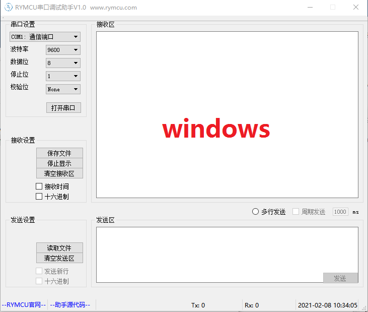
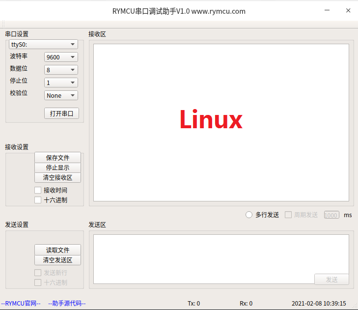
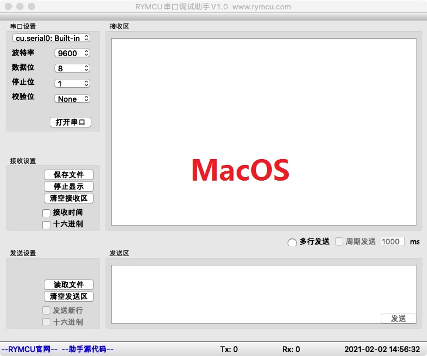
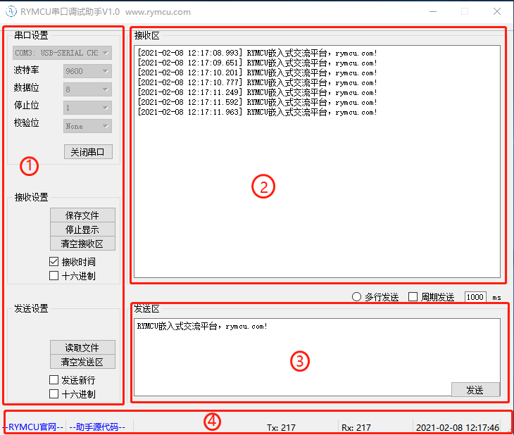
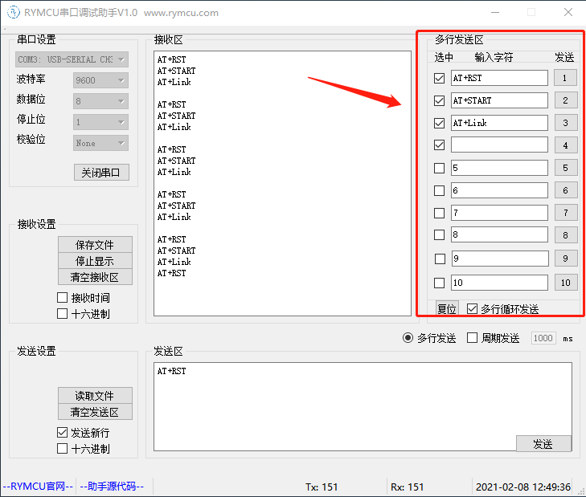
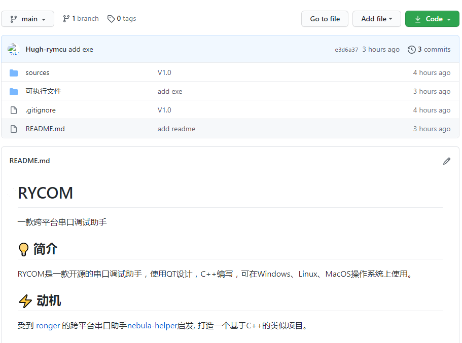

# 1000行代码打造的QT5串口调试助手

#### 所属作品集

QT5串口调试助手RYCOM

### 1.概述

串口调试助手作为嵌入式开发的常用工具，网络上非常的多，功能也十分的强大。因工作原因，需要在 windows、Linux 以及 MacOS 三大操作系统 之间来回切换，需要一款界面统一的跨平台串口助手。网络上搜寻了一番，没有发现合适的，因此决定自己动手写一个。

使用 QT 进行设计，代码 C++，一套代码在三大操作系统上可编译出界面统一的软件，总共代码不超过 1000 行，非常方便快捷。串口功能基本满足嵌入式调试要求，各操作系统下界面如下：

各个操作系统下，界面基本一致，功能完全一样。

### 2.功能介绍

软件界面分成 5 大区域，分别为串口设置、串口接收区、串口发送区、状态显示区以及多行发送功能区。

#### 2.1 串口设置区

- 除了常规的串口参数设置外，串口选择框可以自动刷新，硬件更新时，无需重新打开软件；
- 打开或关闭串口后，相应的控件会不可用，防止误操作，功能非常实用；
- 可以设置为十六进制的方式发送或接收数据，嵌入式调试中经常实用到；
- 可以显示接收时间，接收周期数据的时候，方便观察周期；
- 支持发送文件，并可将接收到的数据存成文本文件；
- 支持自动发送新行；
- 当然还支持周期发送；
- 支持停止显示，清空发送、接收区。

#### 2.2 串口接收区

显示接收数据，接收区数据可保存成文本文件。

#### 2.3 串口发送区

可直接输入数据，或者读取文件到这里进行发送。

#### 2.4 状态显示区

有官网链接、源代码链接！发送和接收数据流量统计，显示当前时间。

#### 2.5 多行发送功能区

在很多场合需要用到发送单条或周期发送多条指令，发送的时候每一条都输一遍效率不高，多行发送功能很好的解决了这个问题。

### 3.源码下载

软件设计过程中，大部分内容来源于网络，因此，我们决定开源源代码！[[RYCOM 串口调试助手源码\]](https://github.com/rymcu/RYCOM)

### 4.小结

**enjoy！**

#### 所属作品集

QT5串口调试助手RYCOM

原文链接：https://rymcu.com/article/152