# QCustomPlot使用

[qcustomplot库demo和高效实时绘图（底下有扩展网址）](https://github.com/liuzhanchun/qcustomplot_project)
[QCustomPlot使用心得四：动态曲线和绘图效率测试(qcustomplot_solution.pro)](https://blog.csdn.net/yxy244/article/details/100099876)

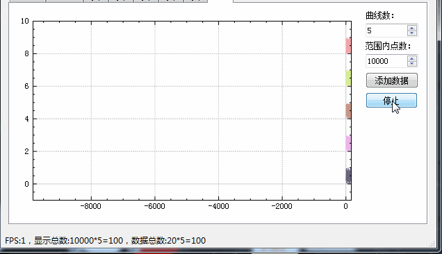

[基于Qt的频谱分析器，修改于spek](https://github.com/Greedysky/QtSpek)

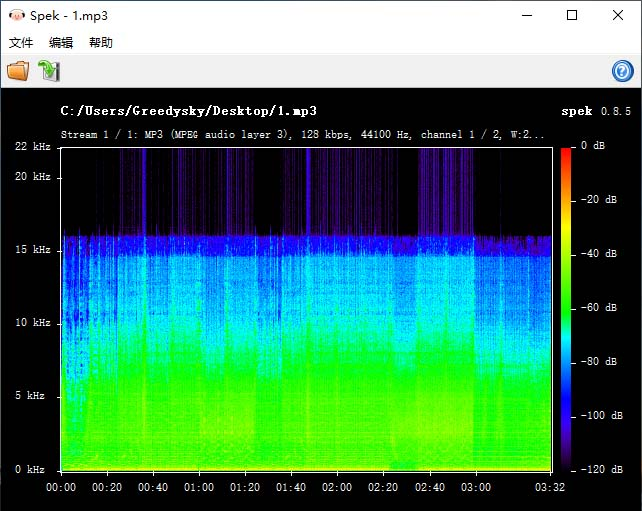

[qtcsdr](https://github.com/ha7ilm/qtcsdr)

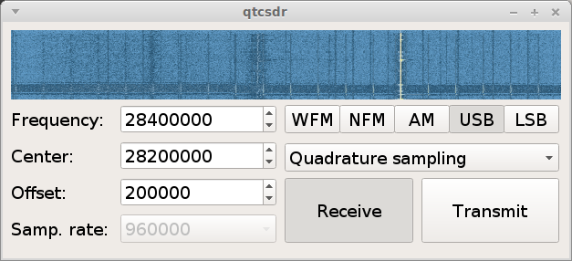

[Spectrum analyzer for multiple SDR platforms(有最大保持等)](https://github.com/xmikos/qspectrumanalyzer)

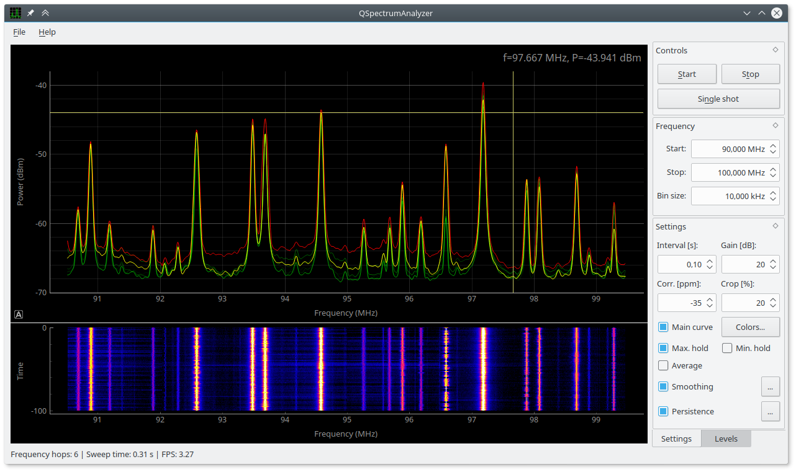

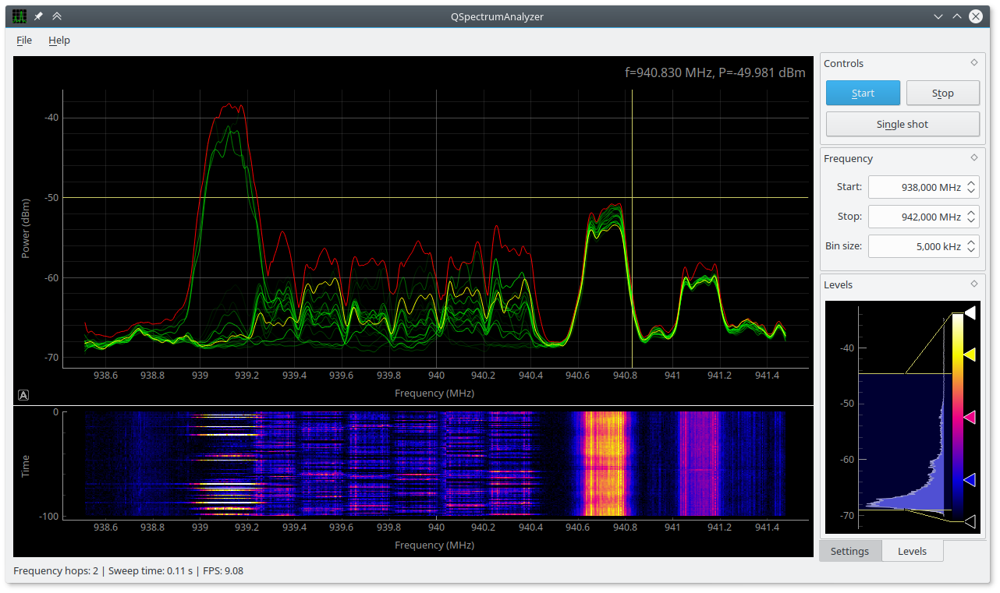

[Qt之QCustomPlot概述](https://blog.csdn.net/qq_18260845/article/details/104195147)
[QCustomPlot使用手册（一）](https://blog.csdn.net/llq108/article/details/45603047)
[QCustomPlot使用手册（二）](https://blog.csdn.net/llq108/article/details/45622285?spm=1001.2014.3001.5501)
[QCustomPlot使用手册（三）](https://blog.csdn.net/llq108/article/details/46420513?spm=1001.2014.3001.5501)
[QCustomPlot使用手册（四）](https://blog.csdn.net/llq108/article/details/46461529?spm=1001.2014.3001.5501)

一、官网下载
https://www.qcustomplot.com/ 　从官网下载 qcustomplot.h 和 qcustomplot.cpp
[QCustomPlot官网下载](https://www.qcustomplot.com/index.php/download)
[官网函数手册Reference](https://www.qcustomplot.com/documentation/classQCustomPlot.html#a2836a46e31d5aee174ae054c0aa6580b)
2.1版本类图：

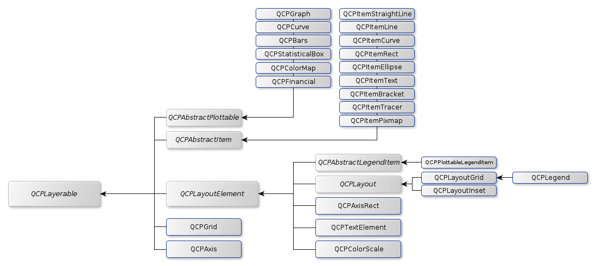

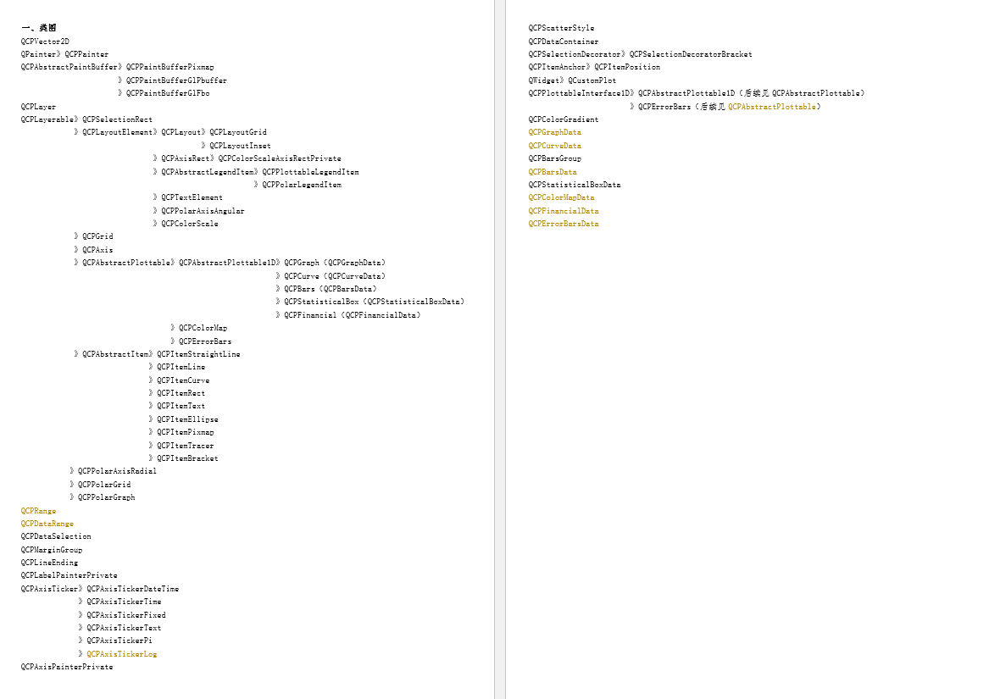

一个图包括：坐标轴、图形、标题、题注、文字。
图形类别：

> 1、QCPGraph主要的画图类型， QCustomPlot::addGraph(), QCustomPlot::graph()
> 2、QCPCurve是一个key有多个值，与QCPGraph不同，此类型的绘图表可能具有多个具有相同键坐标的点，因此它们的可视表示可以具有循环。这是通过引入第三坐标t来实现的，该坐标定义了其他两个坐标x和y所描述的点的顺序。
> 3、QCPBars柱状图
> 4、QCPStaticicalBox统计图
> 5、QCPColorMap色谱图
> 6、QCPFinancial K线图

二、加入工程
通过添加现有文件将 qcustomplot.h、qcustomplot.cpp加入工程，并在pro文件中加入printsupport

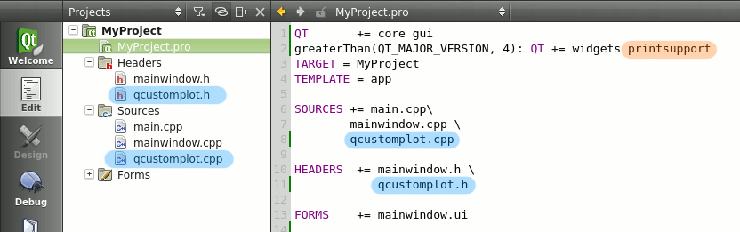

使用openGL：
```
QT  += opengl       					#使用opengl
DEFINES += QCUSTOMPLOT_USE_OPENGL  		#使用opengl
INCLUDEPATH += $$PWD/freeglut/include	#依赖freeglut库以及头文件
LIBS += -L -llibfreeglut -lopengl32     #依赖opengl库文件
LIBS += -L$$PWD/freeglut/lib/x64  -lfreeglut

#include <GL/freeglut.h>
setOpenGl(true);
qDebug() << openGl();
```
三、使用
1、静态生成（QT Designer 中 prompt 插件）
放置widget并提升为QCustomPlot，名称为myplot

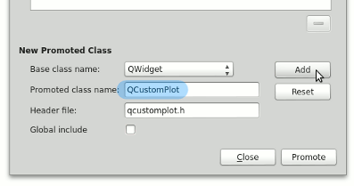

点击添加按钮将QCustomPlot加入到提升类列表中，
点击提升按钮将widget提升为QCustomPlot类

2、动态生成
```
QWidget *paintArea = new QWidget;
QCustomPlot *myPlot = new QCustomPlot(paintArea);
myPlot->setFixedSize(480,300);
//blue line
myPlot->addGraph();
myPlot->graph(0)->setPen(QPen(Qt::blue));
//xAxis
myPlot->axisRect()->setupFullAxesBox();
myPlot->xAxis->setRange(1, 1, Qt::AlignRight);
myPlot->yAxis->setRange(30, 30, Qt::AlignRight);
myPlot->xAxis->setLabel("I(A)");
myPlot->yAxis->setLabel("U(V)");
```
3、画图
customPlot->xAxis, yAxis, xAxis2, and yAxis2分别是底、左、上、右的轴
设置轴的刻度数目：xAxis->ticker()->setTickCount(6);
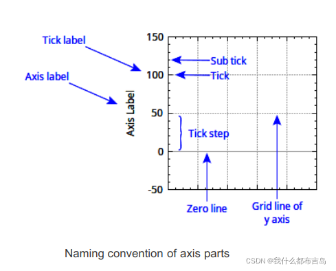

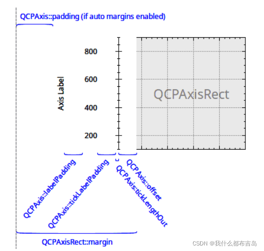

[QCPAxisTicker坐标刻度官方文档](https://www.qcustomplot.com/documentation/classQCPAxisTicker.html#details)
[QCustomPlot使用心得五：坐标轴常用属性设置（这个好）](https://blog.csdn.net/yxy244/article/details/100311112?spm=1001.2014.3001.5501)
[QCustomplot使用分享(六) 坐标轴和网格线](https://www.cnblogs.com/swarmbees/p/6059812.html)
[QCPAxisTicker坐标轴类(一)](https://blog.csdn.net/bwangk/article/details/81950598)
[QCustomPlot 曲线各种属性详细介绍](https://blog.csdn.net/LL58189034/article/details/104342980?utm_medium=distribute.wap_relevant.none-task-blog-2~default~BlogCommendFromBaidu~default-1.withoutpaiwithsearchfrombaidu_wap&depth_1-utm_source=distribute.wap_relevant.none-task-blog-2~default~BlogCommendFromBaidu~default-1.withoutpaiwithsearchfrombaidu_wap)
[QCustomPlot 2.0.1类、函数思维导图](https://blog.csdn.net/Bing_Lee/article/details/108524206?utm_medium=distribute.pc_relevant.none-task-blog-2~default~baidujs_title~default-5.no_search_link&spm=1001.2101.3001.4242)
[15.QCustomPlot数据结构](https://blog.csdn.net/wjffsx/article/details/114693542?spm=1001.2014.3001.5501)

要在屏幕上显示对绘图的任何更改，调用 customPlot->replot() 。
请注意，replot 函数在当调整widget的大小并触发内置用户交互时，将自动发生重新绘制。比如：用户交互例、用鼠标拖动轴范围、用鼠标滚轮缩放。
```
// 产生数据
QVector<double> x(101), y(101); // initialize with entries 0..100
for (int i=0; i<101; ++i)
{
  x[i] = i/50.0 - 1; // x goes from -1 to 1
  y[i] = x[i]*x[i]; // let's plot a quadratic function
}
// create graph and assign data to it:
customPlot->addGraph();  //创建新图
customPlot->graph(0)->setData(x, y);//指定数据
// give the axes some labels:
customPlot->xAxis->setLabel("x");
customPlot->yAxis->setLabel("y");
// set axes ranges, so we see all data:
customPlot->xAxis->setRange(-1, 1);
customPlot->yAxis->setRange(0, 1);
customPlot->replot();//重绘，数据变化时调用
```
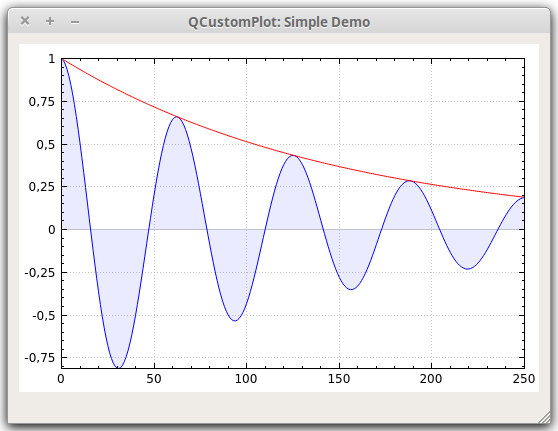
```
// period as decimal separator and comma as thousand separator
customPlot->setLocale(QLocale(QLocale::English, QLocale::UnitedKingdom)); 
customPlot->legend->setVisible(true);
QFont legendFont = font();  // start out with MainWindow's font..
legendFont.setPointSize(9); // and make a bit smaller for legend
customPlot->legend->setFont(legendFont);
customPlot->legend->setBrush(QBrush(QColor(255,255,255,230)));
// by default, the legend is in the inset layout of the main axis rect. 
//So this is how we access it to change legend placement:
customPlot->axisRect()->insetLayout()->setInsetAlignment(0, Qt::AlignBottom|Qt::AlignRight);

// setup for graph 0: key axis left, value axis bottom
// will contain left maxwell-like function
customPlot->addGraph(customPlot->yAxis, customPlot->xAxis);
customPlot->graph(0)->setPen(QPen(QColor(255, 100, 0)));
customPlot->graph(0)->setBrush(QBrush(QPixmap("./balboa.jpg"))); // fill with texture of specified image
customPlot->graph(0)->setLineStyle(QCPGraph::lsLine);
customPlot->graph(0)->setScatterStyle(QCPScatterStyle(QCPScatterStyle::ssDisc, 5));
customPlot->graph(0)->setName("Left maxwell function");

// setup for graph 1: key axis bottom, value axis left (those are the default axes)
// will contain bottom maxwell-like function with error bars
customPlot->addGraph();
customPlot->graph(1)->setPen(QPen(Qt::red));
customPlot->graph(1)->setBrush(QBrush(QPixmap("./balboa.jpg"))); // same fill as we used for graph 0
customPlot->graph(1)->setLineStyle(QCPGraph::lsStepCenter);
customPlot->graph(1)->setScatterStyle(QCPScatterStyle(QCPScatterStyle::ssCircle, Qt::red, Qt::white, 7));
customPlot->graph(1)->setName("Bottom maxwell function");
QCPErrorBars *errorBars = new QCPErrorBars(customPlot->xAxis, customPlot->yAxis);
errorBars->removeFromLegend();
errorBars->setDataPlottable(customPlot->graph(1));

// setup for graph 2: key axis top, value axis right
// will contain high frequency sine with low frequency beating:
customPlot->addGraph(customPlot->xAxis2, customPlot->yAxis2);
customPlot->graph(2)->setPen(QPen(Qt::blue));
customPlot->graph(2)->setName("High frequency sine");

// setup for graph 3: same axes as graph 2
// will contain low frequency beating envelope of graph 2
customPlot->addGraph(customPlot->xAxis2, customPlot->yAxis2);
QPen blueDotPen;
blueDotPen.setColor(QColor(30, 40, 255, 150));
blueDotPen.setStyle(Qt::DotLine);
blueDotPen.setWidthF(4);
customPlot->graph(3)->setPen(blueDotPen);
customPlot->graph(3)->setName("Sine envelope");

// setup for graph 4: key axis right, value axis top
// will contain parabolically distributed data points with some random perturbance
customPlot->addGraph(customPlot->yAxis2, customPlot->xAxis2);
customPlot->graph(4)->setPen(QColor(50, 50, 50, 255));
customPlot->graph(4)->setLineStyle(QCPGraph::lsNone);
customPlot->graph(4)->setScatterStyle(QCPScatterStyle(QCPScatterStyle::ssCircle, 4));
customPlot->graph(4)->setName("Some random data around\na quadratic function");

// generate data, just playing with numbers, not much to learn here:
QVector<double> x0(25), y0(25);
QVector<double> x1(15), y1(15), y1err(15);
QVector<double> x2(250), y2(250);
QVector<double> x3(250), y3(250);
QVector<double> x4(250), y4(250);
for (int i=0; i<25; ++i) // data for graph 0
{
  x0[i] = 3*i/25.0;
  y0[i] = qExp(-x0[i]*x0[i]*0.8)*(x0[i]*x0[i]+x0[i]);
}
for (int i=0; i<15; ++i) // data for graph 1
{
  x1[i] = 3*i/15.0;;
  y1[i] = qExp(-x1[i]*x1[i])*(x1[i]*x1[i])*2.6;
  y1err[i] = y1[i]*0.25;
}
for (int i=0; i<250; ++i) // data for graphs 2, 3 and 4
{
  x2[i] = i/250.0*3*M_PI;
  x3[i] = x2[i];
  x4[i] = i/250.0*100-50;
  y2[i] = qSin(x2[i]*12)*qCos(x2[i])*10;
  y3[i] = qCos(x3[i])*10;
  y4[i] = 0.01*x4[i]*x4[i] + 1.5*(rand()/(double)RAND_MAX-0.5) + 1.5*M_PI;
}

// pass data points to graphs:
customPlot->graph(0)->setData(x0, y0);
customPlot->graph(1)->setData(x1, y1);
errorBars->setData(y1err);
customPlot->graph(2)->setData(x2, y2);
customPlot->graph(3)->setData(x3, y3);
customPlot->graph(4)->setData(x4, y4);
// activate top and right axes, which are invisible by default:
customPlot->xAxis2->setVisible(true);
customPlot->yAxis2->setVisible(true);
// set ranges appropriate to show data:
customPlot->xAxis->setRange(0, 2.7);
customPlot->yAxis->setRange(0, 2.6);
customPlot->xAxis2->setRange(0, 3.0*M_PI);
customPlot->yAxis2->setRange(-70, 35);
// set pi ticks on top axis:
customPlot->xAxis2->setTicker(QSharedPointer<QCPAxisTickerPi>(new QCPAxisTickerPi));
// add title layout element:
customPlot->plotLayout()->insertRow(0);
customPlot->plotLayout()->addElement(0, 0, 
		new QCPTextElement(customPlot, "Way too many graphs in one plot", QFont("sans", 12, QFont::Bold)));
// set labels:
customPlot->xAxis->setLabel("Bottom axis with outward ticks");
customPlot->yAxis->setLabel("Left axis label");
customPlot->xAxis2->setLabel("Top axis label");
customPlot->yAxis2->setLabel("Right axis label");
// make ticks on bottom axis go outward:
customPlot->xAxis->setTickLength(0, 5);
customPlot->xAxis->setSubTickLength(0, 3);
// make ticks on right axis go inward and outward:
customPlot->yAxis2->setTickLength(3, 3);
customPlot->yAxis2->setSubTickLength(1, 1);
```

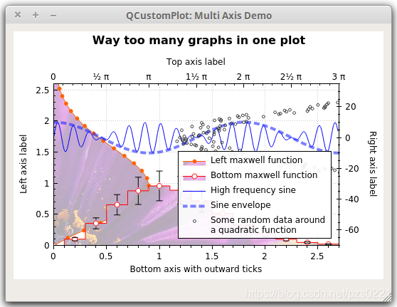
```
// set locale to english, so we get english month names:
customPlot->setLocale(QLocale(QLocale::English, QLocale::UnitedKingdom));
// seconds of current time, we'll use it as starting point in time for data:
double now = QDateTime::currentDateTime().toTime_t();
srand(8); // set the random seed, so we always get the same random data
// create multiple graphs:
for (int gi=0; gi<5; ++gi)
{
  customPlot->addGraph();
  QColor color(20+200/4.0*gi,70*(1.6-gi/4.0), 150, 150);
  customPlot->graph()->setLineStyle(QCPGraph::lsLine);
  customPlot->graph()->setPen(QPen(color.lighter(200)));
  customPlot->graph()->setBrush(QBrush(color));
  // generate random walk data:
  QVector<QCPGraphData> timeData(250);
  for (int i=0; i<250; ++i)
  {
    timeData[i].key = now + 24*3600*i;
    if (i == 0)
      timeData[i].value = (i/50.0+1)*(rand()/(double)RAND_MAX-0.5);
    else
      timeData[i].value = qFabs(timeData[i-1].value)*(1+0.02/4.0*(4-gi)) + (i/50.0+1)*(rand()/(double)RAND_MAX-0.5);
  }
  customPlot->graph()->data()->set(timeData);
}
// configure bottom axis to show date instead of number:
QSharedPointer<QCPAxisTickerDateTime> dateTicker(new QCPAxisTickerDateTime);
dateTicker->setDateTimeFormat("d. MMMM\nyyyy");
customPlot->xAxis->setTicker(dateTicker);
// configure left axis text labels:
QSharedPointer<QCPAxisTickerText> textTicker(new QCPAxisTickerText);
textTicker->addTick(10, "a bit\nlow");
textTicker->addTick(50, "quite\nhigh");
customPlot->yAxis->setTicker(textTicker);
// set a more compact font size for bottom and left axis tick labels:
customPlot->xAxis->setTickLabelFont(QFont(QFont().family(), 8));
customPlot->yAxis->setTickLabelFont(QFont(QFont().family(), 8));
// set axis labels:
customPlot->xAxis->setLabel("Date");
customPlot->yAxis->setLabel("Random wobbly lines value");
// make top and right axes visible but without ticks and labels:
customPlot->xAxis2->setVisible(true);
customPlot->yAxis2->setVisible(true);
customPlot->xAxis2->setTicks(false);
customPlot->yAxis2->setTicks(false);
customPlot->xAxis2->setTickLabels(false);
customPlot->yAxis2->setTickLabels(false);
// set axis ranges to show all data:
customPlot->xAxis->setRange(now, now+24*3600*249);
customPlot->yAxis->setRange(0, 60);
// show legend with slightly transparent background brush:
customPlot->legend->setVisible(true);
customPlot->legend->setBrush(QColor(255, 255, 255, 150));
```

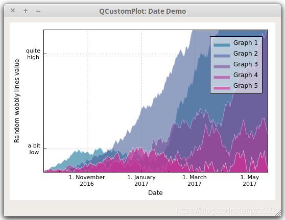

四、高级应用
[QT5使用QCustomplot绘制频谱瀑布图并封快速傅里叶变换fft类(myplot.pro)](https://blog.csdn.net/jlf521521/article/details/106689503)
[QCustomplot绘制实时波形图（频谱图、瀑布图、星座图）并开启opengl支持](https://blog.csdn.net/qing666888/article/details/104015959)
[QCustomplot系列文章（这个好）](https://www.cnblogs.com/swarmbees/category/908110.html)
[QCustomPlot 绘制多条动态曲线性能测试(LXCustomPlot.pro)](https://gitee.com/xmlhh/LXCustomPlot/)
[QCustomPlot 使用整理](https://www.cnblogs.com/pied/p/5164000.html)
[5.QCustomPlot 创建动态轴标签（有系列文章）](https://blog.csdn.net/wjffsx/article/details/114651242?spm=1001.2014.3001.5501)
[12.QCustomPlot中数据选择机制（有系列文章）](https://blog.csdn.net/wjffsx/article/details/114653464?spm=1001.2014.3001.5501)
[QT应用编程: 使用qcustomplot显示动态曲线、设计心电图显示页面(有动态和数据指针)](https://xiaolong.blog.csdn.net/article/details/116694318?spm=1001.2101.3001.6650.2&utm_medium=distribute.wap_relevant.none-task-blog-2~default~BlogCommendFromBaidu~default-2.withoutpaiwithsearchfrombaidu_wap&depth_1-utm_source=distribute.wap_relevant.none-task-blog-2~default~BlogCommendFromBaidu~default-2.withoutpaiwithsearchfrombaidu_wap)
1、1.0版本更新大数据

数据量少时，用setData() 和 addData()给图传数据（内部拷贝效率低）；
数据量大时，用data()接口。
```
void addToDataBuffer(float x, float y)
{
    QCPData newData;
    newData.key = x;
    newData.value = y;
    
    QCPDataMap *mData = myPlot->graph(0)->data();
//	mData->clear();//根据情况
    mData->insert(x, newData);
}
```
QCPDataMap 可以看做坐标横纵坐标的组合 （x，y）, 用insert() 添加数据；如果需要key 对应多个值则使用 insertMulti( )往 buffer 里面添加数据。

画新曲线之前，先 clear() 一下 buffer ；更新数据后，replot() 一下。

2、2.0版本更新大数据
（1）传值法（直接调用无需修改QCustomplot）
下面是源码示例中更新数据方法，画图数据的核心是 mData，是一个 QCPGraphData 类型的 Vector，所以，我们直接构建这样一个 Vector，把内部的替换掉即可。可惜这里不是指针，函数内实现方式是用我们提供的 mData 给内部 mData 赋值，也就是，还是要进行一次拷贝。当然，你也可以去改它的代码把这个指针给放出来。
：
```
void MainWindow::addNewData()
{
    QSharedPointer< QCPGraphDataContainer > dataContainer;
    dataContainer = customplot->graph(0)->data();
    QVector<QCPGraphData> mData; //warning: it's a local var
    QCPGraphData newPoint; 
    newPoint.key = 123;
    newPoint.value = 456;
    mData.append(newPoint);
    dataContainer->set(mData,true); //if the data has been sorted, set true
}
```
（2）指针法（需修改QCustomplot.h）
修改如下：
```
void MainWindow::mDataDirect(QCustomPlot *customPlot)
{
    demoName = "mData";
    customPlot->addGraph();
    QVector<QCPGraphData> *mData;
    mData = customPlot->graph(0)->data()->coreData();//自己添加获得指针的函数
    mData->clear();

    QCPGraphData newPoint;
    for (int i=0; i<101; ++i)
    {
        double tmp = i/50.0 - 1; 
        newPoint.key = tmp;
        newPoint.value = tmp * tmp;  // let's plot a quadratic function
        mData->append(newPoint);
    }
    // give the axes some labels:
    customPlot->xAxis->setLabel("x");
    customPlot->yAxis->setLabel("y");
    // set axes ranges, so we see all data:
    customPlot->xAxis->setRange(-1, 1);
    customPlot->yAxis->setRange(0, 1);
}
```
在 qcustomplot.h 中加入myMethod这一行
```
  // setters:
  void setAutoSqueeze(bool enabled);

  // myMethod
  QVector<DataType>* coreData() {return &mData;}

  // non-virtual methods:
  void set(const QCPDataContainer<DataType> &data);
```
3、设置画图区域的背景色
```
	QBrush backRole;
	backRole.setColor("skyblue");
	backRole.setStyle(Qt::SolidPattern);//不加 SolidPattern，画出来的图是透明的
	myPlot->setBackground(backRole);
```
4、实时显示
[qcustomplot实时滚动显示，内存释放删除数据](http://labisart.com/blog/index.php/Home/Index/article/aid/201)
[QCustomPlot实现实时动态曲线](https://blog.csdn.net/qq_31776303/article/details/79410185?utm_medium=distribute.pc_relevant.none-task-blog-2~default~CTRLIST~default-2.no_search_link&depth_1-utm_source=distribute.pc_relevant.none-task-blog-2~default~CTRLIST~default-2.no_search_link)
[QCustomPlot系列(5)-实时动态曲线](https://blog.csdn.net/qq_31073871/article/details/90260275?utm_medium=distribute.pc_relevant.none-task-blog-2~default~essearch~vector-10.no_search_link&depth_1-utm_source=distribute.pc_relevant.none-task-blog-2~default~essearch~vector-10.no_search_link)
[QCustomPlot系列](https://blog.csdn.net/qq_31073871/category_8935784.html)

5、小例子

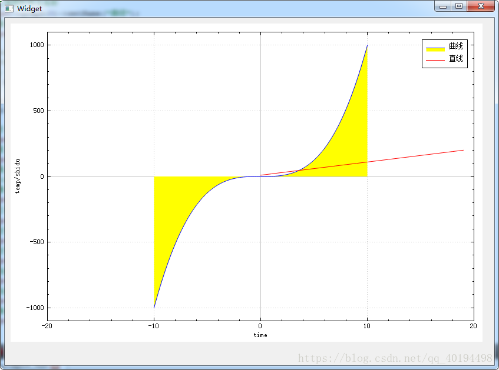
```
//设定背景为黑色
		//ui->widget->setBackground(QBrush(Qt::black));
        //设定右上角图形标注可见
        ui->widget->legend->setVisible(true);
        //设定右上角图形标注的字体
        ui->widget->legend->setFont(QFont("Helvetica", 9));
        QVector<double> x(101),y(101);
            //图形为y=x^3
            for(int i=0;i<101;i++)
            {
                x[i] = i/5.0-10;
                y[i] = x[i]*x[i]*x[i];//qPow(x[i],3)
            }
            //添加图形
            ui->widget->addGraph();
            //设置画笔
            ui->widget->graph(0)->setPen(QPen(Qt::blue));
            //设置画刷,曲线和X轴围成面积的颜色
             ui->widget->graph(0)->setBrush(QBrush(QColor(255,255,0)));
            //设置右上角图形标注名称
            ui->widget->graph(0)->setName("曲线");
            //传入数据，setData的两个参数类型为double
            ui->widget->graph(0)->setData(x,y);

            QVector<double> temp(20);
            QVector<double> temp1(20);
            //图形为y = 100*x;
            for(int i=0;i<20;i++)
            {
                temp[i] = i;
                temp1[i] = 10*i+10;
            }
            //添加图形
            ui->widget->addGraph();
            //设置画笔
            ui->widget->graph(1)->setPen(QPen(Qt::red));
            //设置画刷,曲线和X轴围成面积的颜色
            //ui->widget->graph(1)->setBrush(QBrush(QColor(0,255,0)));  
            //传入数据
            ui->widget->graph(1)->setData(temp,temp1);  
            
            /*-------------------------------------------*/
            //画动态曲线时，传入数据采用addData，通过定时器多次调用，并在之后调用ui->widget->replot(); 
            //动态曲线可以通过另一种设置坐标的方法解决坐标问题： 
            //setRange ( double  position, double  size, Qt::AlignmentFlag  alignment  )  
            //参数分别为：原点，偏移量，对其方式，有兴趣的读者可自行尝试，欢迎垂询  
            /*-------------------------------------------*/ 
            
            //设置右上角图形标注名称
            ui->widget->graph(1)->setName("直线");
            //设置X轴文字标注
            ui->widget->xAxis->setLabel("time");
            //设置Y轴文字标注
            ui->widget->yAxis->setLabel("temp/shidu");
            //设置X轴坐标范围
            ui->widget->xAxis->setRange(-20,20);
            //设置Y轴坐标范围
            ui->widget->yAxis->setRange(-1100,1100);
            //在坐标轴右侧和上方画线，和X/Y轴一起形成一个矩形
            ui->widget->axisRect()->setupFullAxesBox(); 
```

6、刻度设置、鼠标显示数据
[QCustomPlot之QCPAxisTicker坐标轴类](https://blog.csdn.net/bwangk/article/details/81950598)
[QCustomPlot绘制天气曲线图并动态显示曲线坐标值](https://blog.csdn.net/bwangk/article/details/82082133)
[QCustomPlot中用直线标示曲线的值](https://blog.csdn.net/v6543210/article/details/84140985)
[QCustomplot使用分享(九) 绘制图表-多功能游标](https://www.cnblogs.com/swarmbees/p/11745738.html)
```
//设置坐标轴刻度
QVector<double> vTick;
QVector<QString> vTickLabel;
this->xAxis->setTickVector();
this->xAxis->setTickVectorLabels();
```
7、动态曲线及性能
[QCustomPlot 动态曲线和绘图效率测试(qcustomplot_solution.pro)](https://blog.csdn.net/ghostrabbit/article/details/116998575?utm_medium=distribute.pc_relevant.none-task-blog-2~default~CTRLIST~default-1.no_search_link&depth_1-utm_source=distribute.pc_relevant.none-task-blog-2~default~CTRLIST~default-1.no_search_link)
[项目记录 - Qt QCustomPlot 实时动态数据曲线图，以时间为X轴，数据为Y轴（二）](https://blog.csdn.net/qq_38159549/article/details/105295277?utm_medium=distribute.pc_relevant.none-task-blog-2~default~baidujs_title~default-4.no_search_link&spm=1001.2101.3001.4242.4)
[动态时间轴 2.0版本](https://blog.csdn.net/weixin_43637946/article/details/112538087)

1.0版本中设置时间轴
```
	//设置X轴时间刻度
	ui->customplot->xAxis->setTickLabelType(QCPAxis::ltDateTime);
	ui->customplot->xAxis->setDateTimeFormat("hh:mm:ss");
	ui->customplot->xAxis->setDateTimeSpec(Qt::LocalTime);
```
2.0版本中设置时间轴
```
	//设置X轴时间刻度
	QSharedPointer<QCPAxisTickerDateTime> dateTick(new QCPAxisTickerDateTime);
	dateTick->setDateTimeFormat("hh:mm:ss");
	ui->customplot->xAxis->setTicker(dateTick);
```
动态时间轴的关键步骤：
```
//秒中间插入数据的关键是有小数，不能直接 /1000,而是/1000.0
double t = (double)(QDateTime::currentMSecsSinceEpoch()) / 1000.0;
pGraph->addData(t, y);
//时间轴滚动
double curSeclf = QDateTime::currentDateTime().toMSecsSinceEpoch()/1000.0;
 //(double)(QDateTime::currentMSecsSinceEpoch()) / 1000.0;
this->xAxis->setRange(curSeclf + 0.25, 4, Qt::AlignRight);
this->replot();
//删除滚动出图表的数据
pGraph->data().data()->removeBefore(0);
```
Y轴作为时间轴进行滚动：
```
QCPGraph * addGraph(QCPAxis * keyAxis = 0, QCPAxis * valueAxis = 0)
this->addGraph(yAxis,xAxis);//y轴为key值，x轴为value
```
删除过期数据：

V1.x版本中是有removeDataBefore()的，可以删除之前的数据，但v2.x时，这个函数被取缔了，但它经常会在绘制动态图中用到，可修改QCustomPlot源码进行添加，在QCPGraph类中增加公有成员函数。
```
//qcustomplot.h中
void removeDataBefore(int size);

//qcustomplot.cpp中
void QCPGraph::removeDataBefore(int size)
{
    mDataContainer->removeBefore(mDataContainer->size()-size);
}
```

```
//获取时间ms的不同方法
int QTime::msecsSinceStartOfDay();
QDateTime::currentDateTime().toMesecsSince Epoch()；
QTime curTime(QTime::currentTime());
int ms = curTime.hour()*60*60*1000+curTime.minute()*60*1000+curTime.second()*1000+curTime.msec();
```
8、坐标轴单位
[Qt QcustomPlot 多条Y轴在垂直布局中对齐的方法](https://blog.csdn.net/gxt19950304/article/details/118295001?utm_medium=distribute.wap_relevant.none-task-blog-2~default~baidujs_title~default-8.withoutpaiwithsearchfrombaidu_wap)
```
/* 上面代码使得Y轴轴线始终对齐，下面的代码使得Y轴的标签始终对齐  */
QCPItemText *DataAquisition::setYaxisLabel(QCPAxis *yAxis, QString label, QCPAxisRect *rect)
{
    QCPItemText* yAxisLabel = new QCPItemText(ui->customplot);
    yAxisLabel->setText(label);
    yAxisLabel->setRotation(90);
    yAxisLabel->position->setAxisRect(rect);
    yAxisLabel->setClipToAxisRect(false);
    //x is absolut position
    yAxisLabel->position->setTypeX(QCPItemPosition::ptAbsolute);
    //y is relativ to AxesRect
    yAxisLabel->position->setTypeY(QCPItemPosition::ptAxisRectRatio);
    yAxisLabel->position->setAxes(0, yAxis);
    yAxisLabel->position->setCoords(10, 0.5);

    return yAxisLabel;
}
```
9、缩放
[QCustomPlot实现矩形缩放图表](https://blog.csdn.net/onlyshi/article/details/51508178?utm_medium=distribute.wap_relevant.none-task-blog-2~default~BlogCommendFromBaidu~default-2.withoutpaiwithsearchfrombaidu_wap&depth_1-utm_source=distribute.wap_relevant.none-task-blog-2~default~BlogCommendFromBaidu~default-2.withoutpaiwithsearchfrombaidu_wap)
[QCustomPlot系列： 实现X轴，Y轴的单独滚轮缩放数据](https://blog.csdn.net/weixin_39328406/article/details/112007876)

.h文件
```
#ifndef CROWDATAPLOT_H
#define CROWDATAPLOT_H

#include <QWidget>
#include "qcustomplot.h"

class CRowDataPlot : public QCustomPlot
{
public:
    CRowDataPlot(QWidget * parent = nullptr);

private slots:
    void onMouseWheel();
};

#endif // CROWDATAPLOT_H
```
.cpp文件
```
#include "crowdataplot.h"
CRowDataPlot::CRowDataPlot(QWidget * parent) :QCustomPlot(parent)
{
    //--1 设置plot属性
    setInteractions(QCP::iRangeDrag|QCP::iRangeZoom| QCP::iSelectAxes
                                    |QCP::iSelectLegend | QCP::iSelectPlottables);
    //--2 连接鼠标滚轮信号和槽
    connect(this, &CRowDataPlot::mouseWheel, this, &CRowDataPlot::onMouseWheel);
}

void CRowDataPlot::onMouseWheel()
{
    if (xAxis->selectedParts().testFlag(QCPAxis::spAxis))
        axisRect()->setRangeZoom(xAxis->orientation());
    else if (yAxis->selectedParts().testFlag(QCPAxis::spAxis))
        axisRect()->setRangeZoom(yAxis->orientation());
    else
        axisRect()->setRangeZoom(Qt::Horizontal|Qt::Vertical);
}
```
10、画圆
[使用QCPItemEllipse画圆](https://blog.csdn.net/Viciower/article/details/113140204)
[qcustomplot画圆](https://blog.csdn.net/weixin_60630397/article/details/120593143)
.h文件：
```
private: 
    QCPItemEllipse *m_pCPItemEllipse;         //一个圆 
    QCPItemEllipse **m_pCPItemEllipseArray;    //多个圆
```
.cpp文件：
```
	//一个圆
	m_pCPItemEllipse = new QCPItemEllipse(ui->customPlot);
	QPen pen(Qt::green, 3, Qt::DashDotLine, Qt::RoundCap, Qt::RoundJoin);
	m_pCPItemEllipse->setPen(pen);
	//圆心C(x, y) 半径r
	//tL(x-r, y+r) bR(x+r, y-r)
	m_pCPItemEllipse->topLeft->setCoords(-120, -80);      //左上角位置 tL
	m_pCPItemEllipse->bottomRight->setCoords(-80, -120);  //右下角位置 bR
	ui->routeShowWidget->replot();
```


```
	//多个圆
	int number = 3;
	m_pCPItemEllipseArray = new QCPItemEllipse *[number];
	for(int vsi = 0; vsi < number; vsi++)
	{
	    m_pCPItemEllipseArray[vsi] = new QCPItemEllipse(ui->customPlot);
	    m_pCPItemEllipseArray[vsi]->topLeft->setCoords(100 + 2 * vsi, 80);   //左上角位置 tL
	    m_pCPItemEllipseArray[vsi]->bottomRight->setCoords(80, 120);         //右下角位置 bR
	 }
	ui->routeShowWidget->replot();
```
11.游标
[游标及鼠标跟踪显示数值](https://blog.csdn.net/qfl_sdu/article/details/115716844)
[QCustomPlot 标记点和文本标签](https://blog.csdn.net/AAA123524457/article/details/82528216?spm=1001.2101.3001.6650.5&utm_medium=distribute.pc_relevant.none-task-blog-2~default~CTRLIST~default-5.no_search_link&depth_1-utm_source=distribute.pc_relevant.none-task-blog-2~default~CTRLIST~default-5.no_search_link)
12、切屏屏闪
解决办法就是在我们的qcustomplot.cpp文件中，找到一个函数void QCPPaintBufferGlFbo::draw(QCPPainter *painter) const函数，大约在899行。
在代码painter->drawImage(0, 0, mGlFrameBuffer->toImage());之前加上一下代码：
```
  if(QOpenGLContext::currentContext() != mGlContext.data()) 
  {
      mGlContext.data()->makeCurrent(mGlContext.data()->surface());
  }
```
13、数据选中、框选放大
[QCustomPlot之数据与图例的选中，曲线的显示与隐藏，放大被框选数据等操作](https://blog.csdn.net/m0_49456900/article/details/125100839)
————————————————

版权声明：本文为CSDN博主「pzs0221」的原创文章，遵循CC 4.0 BY-SA版权协议，转载请附上原文出处链接及本声明。

原文链接：https://blog.csdn.net/pzs0221/article/details/118263290