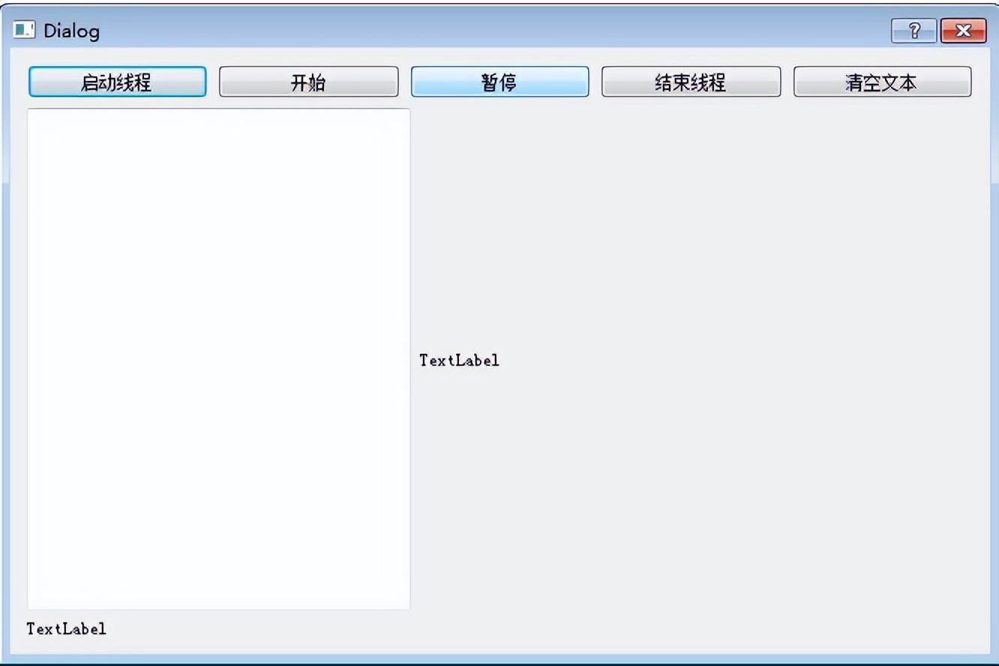

# QThread run() 函数线程示例使用记录

废话不多说 直接上代码

```
#ifndef QDICETHREAD_H
#define QDICETHREAD_H
#include <QObject>
#include <QThread>
#include <QTime>
class QDiceThread : public QThread
{
    Q_OBJECT
public:
    explicit QDiceThread(QObject *parent = nullptr);
    void diceBegin();
    void dicePause();
    void stopThread();
protected:
    void run() Q_DECL_OVERRIDE;
signals:
    void newValue(int seq, int diceValue); //产生新点数的信号
public slots:
private:
    int m_seq = 0;  //骰子次数序号
    int m_diceValue; //骰子点数
    bool m_pause = true; // 暂停
    bool m_stop = false; //停止
};
#endif // QDICETHREAD_H

#include "qdicethread.h"
#include <QDebug>
QDiceThread::QDiceThread(QObject *parent) : QThread(parent)
{
}
void QDiceThread::diceBegin()
{
    m_pause = false;
}
void QDiceThread::dicePause()
{
    m_pause = true;
}
void QDiceThread::stopThread()
{
    m_stop = true;
}
void QDiceThread::run()
{
    qDebug() << "sdasdsd";
    qDebug() << QThread::currentThreadId();
    m_stop = false;
    m_seq =0;
    qsrand(QTime::currentTime().msec()); //随机数初始化
    while(!m_stop)
    {
        if(!m_pause)
        {
            m_diceValue =qrand();
            m_diceValue = (m_diceValue %6)+1 ;
            m_seq++;
            emit newValue(m_seq,m_diceValue);
        }
        msleep(500);
    }
    quit(); //相当于exit（0）,退出线程的时间循环
}

#ifndef DIALOG_H
#define DIALOG_H
#include <QDialog>
#include "qdicethread.h"
namespace Ui {
class Dialog;
}
class Dialog : public QDialog
{
    Q_OBJECT
private:
    QDiceThread threadA;
protected:
    void closeEvent(QCloseEvent *event);
public:
    explicit Dialog(QWidget *parent = 0);
    ~Dialog();
private slots:
    void onthreadA_start();
    void onthreadA_finish();
    void onThreadA_newValue(int seq,int diceValue);
    void on_btnThreadBegin_clicked();
    void on_btnThreadStop_clicked();
    void on_btnDicestart_clicked();
    void on_btnDiceStop_clicked();
    void on_btnClear_clicked();
private:
    Ui::Dialog *ui;
};
#endif // DIALOG_H

#include "dialog.h"
#include "ui_dialog.h"
#include <QDebug>
Dialog::Dialog(QWidget *parent) :
    QDialog(parent),
    ui(new Ui::Dialog)
{
    ui->setupUi(this);
    connect(&threadA,SIGNAL(started()),this,SLOT(onthreadA_start()));
    connect(&threadA,SIGNAL(finished()),this,SLOT(onthreadA_finish()));
    connect(&threadA,SIGNAL(newValue(int,int)),this,SLOT(onThreadA_newValue(int,int)));
}
Dialog::~Dialog()
{
    delete ui;
}
void Dialog::onthreadA_start()
{
    ui->label_2->setText("Thread状态：thread start.");
}
void Dialog::onthreadA_finish()
{
    ui->label_2->setText("Thread状态：thread finish.");
}
void Dialog::onThreadA_newValue(int seq, int diceValue)
{
    QString str=QString::asprintf("第%d次，点数为%d",seq,diceValue);
    ui->plainTextEdit->appendPlainText(str);
    QPixmap pic;
    QString fileName=QString::asprintf(":./images/d%d.jpg",diceValue);
    pic.load(fileName);
    ui->label->setPixmap(pic);
}
void Dialog::on_btnThreadBegin_clicked()
{
    threadA.start();
    ui->btnThreadBegin->setEnabled(false);
    ui->btnThreadStop->setEnabled(true);
    ui->btnDiceStop->setEnabled(false);
    ui->btnDicestart->setEnabled(true);
}
void Dialog::on_btnThreadStop_clicked()
{
    threadA.stopThread();
    threadA.wait();
    ui->btnThreadBegin->setEnabled(true);
    ui->btnThreadStop->setEnabled(false);
    ui->btnDiceStop->setEnabled(false);
    ui->btnDicestart->setEnabled(false);
}
void Dialog::on_btnDicestart_clicked()
{
    threadA.diceBegin();
    ui->btnDicestart->setEnabled(false);
    ui->btnDiceStop->setEnabled(true);
}
void Dialog::on_btnDiceStop_clicked()
{
    threadA.dicePause();
    ui->btnDicestart->setEnabled(true);
    ui->btnDiceStop->setEnabled(false);
}
void Dialog::on_btnClear_clicked()
{
    ui->plainTextEdit->clear();
}
void Dialog::closeEvent(QCloseEvent *event)
{
    if(threadA.isRunning())
    {
        threadA.stopThread();
        threadA.wait();
    }
    event->accept();
}
```





**【领QT开发教程学习资料，点击下方链接莬费领取↓↓，先码住不迷路~】**

**点击这里：[「链接」](http://docs.qq.com/doc/DUlVwTW1FZlZuWE9G)**