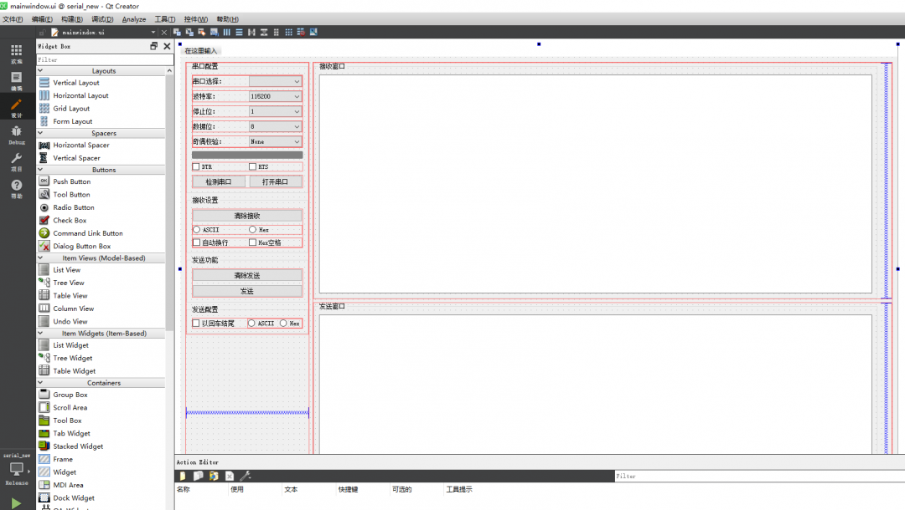
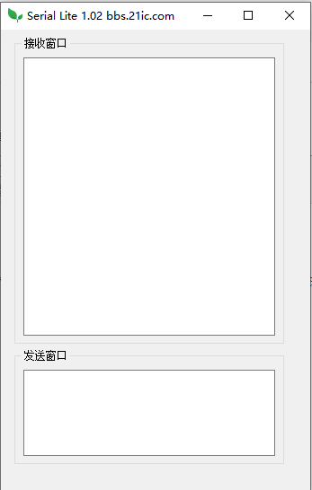
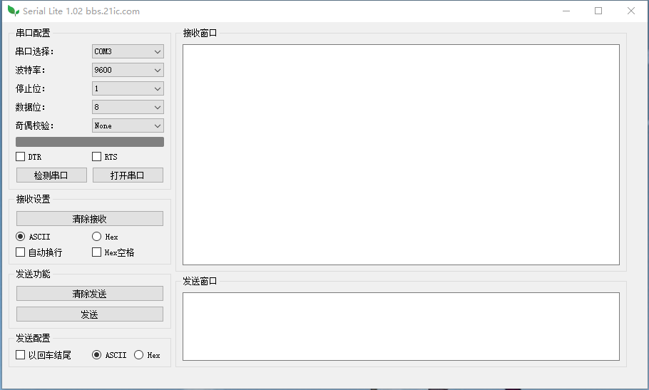

# QT编写的串口助手最新版开源了-全网独一无二

UI设计过程



成品下载地址
https://bbs.21ic.com/icview-3051934-1-1.html

代码下载地址请回复后可见
https://gitee.com/gaoyang9992006
主要文件源码

```
#include "mainwindow.h"

#include "ui_mainwindow.h"


MainWindow::MainWindow(QWidget *parent) :

    QMainWindow(parent),
    
    ui(new Ui::MainWindow)

{

    ui->setupUi(this);
    
    //添加所有串口到comboBox_1里，（串口下拉菜单的名字是comBox_1,可以修改）
    
    foreach(const QSerialPortInfo &info,QSerialPortInfo::availablePorts())
    
    {
    
        ui->comboBox_1->addItem(info.portName());
    
    }
    
    serial=new QSerialPort(this);//为serial开辟空间
    
    //设置默认显示的波特率为9600
    
    ui->comboBox_2->setCurrentIndex(3);
    
    //给2个单选按钮分成一个组。
    
    groupButton1=new QButtonGroup(this);
    
    groupButton1->addButton(ui->radioButton,0);
    
    groupButton1->addButton(ui->radioButton_2,1);
    
    ui->radioButton->setChecked(1);
    
    //给2个单选按钮分成一个组。
    
    groupButton2=new QButtonGroup(this);
    
    groupButton2->addButton(ui->radioButton_3,0);
    
    groupButton2->addButton(ui->radioButton_4,1);
    
    ui->radioButton_3->setChecked(1);


}


MainWindow::~MainWindow()

{

    delete ui;

}


void MainWindow::recv_data(void)

{

    qDebug() << "Recv Data" << endl;
    
    QByteArray buf = serial->readAll();
    
    qDebug() << buf << endl;
    
    if(!buf.isEmpty())
    
    {
    
        /*

QT默认的编码是unicode，不能显示中文的

windows默认使用（GBK/GB2312/GB18030）

使用fromLocal8Bit()函数，实现了从本地字符集GB到Unicode的转换，用于处理汉语显示乱码等问题

*/

        switch (groupButton1->checkedId()) {
    
        case 0:
    
            qDebug()<<"ASCII"<<endl;
    
        {


            QString myStrTemp = QString::fromLocal8Bit(buf); //转化到本地编码格式GB2312支持中文显示


            //如果换行被勾选将会在每次接收显示前换行,另外判断是不是为空，确保第一行不会先给显示个回车符
    
            if((ui->checkBox_3->isChecked())&&(!ui->textEdit_1->toPlainText().isEmpty()))
    
                ui->textEdit_1->insertPlainText("\n");


            ui->textEdit_1->insertPlainText(myStrTemp);


        }
    
            break;


        case 1:
    
            qDebug()<<"Hex  "<<endl;
    
        {


            QDataStream out(&buf,QIODevice::ReadWrite);    //将字节数组读入
    
            //如果换行被勾选将会在每次接收前换行
    
            if(ui->checkBox_3->isChecked())
    
                ui->textEdit_1->insertPlainText("\n");
    
            while (!out.atEnd())
    
            {


                qint8 outChar =0;
    
                out>>outChar;
    
                QString str =QString("%1").arg(outChar&0xFF,2,16,QLatin1Char('0'));


                //插入空格


                if(ui->checkBox_4->isChecked())
    
                    ui->textEdit_1->insertPlainText(str+' ');
    
                else
    
                    ui->textEdit_1->insertPlainText(str);
    
            }


        }


            break;


        }


    }

}


//单击搜索串口按钮，重新获取可用的串口

void MainWindow::on_pushButton_1_clicked()

{

    ui->comboBox_1->clear();
    
    foreach(const QSerialPortInfo &info,QSerialPortInfo::availablePorts())
    
    {
    
        QSerialPort serial;
    
        serial.setPort(info);
    
        if(serial.open(QIODevice::ReadWrite))
    
            ui->comboBox_1->addItem(info.portName());
    
    }

}


void MainWindow::on_pushButton_2_clicked()

{

    if(ui->pushButton_2->text()==tr("打开串口"))
    
    {
    
        ui->pushButton_2->setText(tr("关闭串口"));
    
        serial->setPortName(ui->comboBox_1->currentText());
    
        if(serial->open(QIODevice::ReadWrite))
    
        {
    
            qDebug()<<"Open OK"<<endl;
    
            ui->label_status->setProperty("isOn",true);
    
            ui->label_status->style()->polish(ui->label_status);
    
        }
    
        else
    
        {
    
            qDebug()<<"Open Failed"<<endl;
    
        }
    
        //设置波特率为当前所选的波特率，因为波特率为字符串，所以用强制转换后才能赋值给设置波特率函数。
    
        serial->setBaudRate(ui->comboBox_2->currentText().toInt());


        switch (ui->comboBox_3->currentIndex())
    
        {
    
        case 0: serial->setStopBits(QSerialPort::OneStop); break;
    
        case 1: serial->setStopBits(QSerialPort::TwoStop); break;
    
        case 2: serial->setStopBits(QSerialPort::OneAndHalfStop); break;
    
        default:break;
    
        }


        //设置数据位长度，先获取当前索引，然后对应设置。
    
        switch (ui->comboBox_4->currentIndex())
    
        {
    
        case 0: serial->setDataBits(QSerialPort::Data8); break;
    
        case 1: serial->setDataBits(QSerialPort::Data7); break;
    
        case 2: serial->setDataBits(QSerialPort::Data6); break;
    
        case 3: serial->setDataBits(QSerialPort::Data5); break;
    
        default:break;
    
        }


        //设置奇偶校验，先获取当前索引，然后对应设置。
    
        switch (ui->comboBox_5->currentIndex())
    
        {
    
        case 0: serial->setParity(QSerialPort::NoParity);   break;
    
        case 1: serial->setParity(QSerialPort::OddParity);  break;
    
        case 2: serial->setParity(QSerialPort::EvenParity); break;
    
        case 3: serial->setParity(QSerialPort::SpaceParity);break;
    
        case 4: serial->setParity(QSerialPort::MarkParity); break;
    
        default:break;
    
        }


        {
    
        if(ui->checkBox_1->isChecked())
    
            serial->setDataTerminalReady(true);
    
        if(ui->checkBox_2->isChecked())
    
            serial->setRequestToSend(true);
    
        }


        /*

connect，是QT中的连接函数，将信号发送者sender对象中的信号signal与接受者receiver中的member槽函数联系起来。

*/

        connect(serial,SIGNAL(readyRead()),this,SLOT(recv_data()));
    
    }
    
    else
    
    {
    
        ui->pushButton_2->setText(tr("打开串口"));
    
        serial->close();
    
        qDebug()<<"Close OK"<<endl;
    
        ui->label_status->setProperty("isOn",false);
    
        ui->label_status->style()->polish(ui->label_status);


    }

}


void MainWindow::on_pushButton_5_clicked()

{

    switch (groupButton2->checkedId())
    
    {
    
    case 0:
    
    {


        QByteArray str;
    
        if(ui->checkBox_5->isChecked())
    
        str = (ui->textEdit_2->toPlainText()+'\r').toLocal8Bit();
    
        else
    
        str =  ui->textEdit_2->toPlainText().toLocal8Bit();
    
        qDebug()<<str<<endl;
    
        serial->write(str);


    }
    
        break;


    case 1:
    
    {
    
        QString str =ui->textEdit_2->toPlainText();
    
        str.remove(QRegExp("\\s"));//移除空格
    
        if(str.length()%2==1)
    
            str=str.remove(str.length()-1,1);//如果最后一位不完整，舍弃。
    
        QByteArray text=QByteArray::fromHex(str.toLatin1()); //获取文本框的字符串，转换成字流
    
        qDebug()<<text.data();            // returns 字符串
    
        serial->write(text.data());
    
    }


        break;


    default:break;


    }


}

//清除发送文本框内容

void MainWindow::on_pushButton_4_clicked()

{

    ui->textEdit_2->clear();

}

//清除接收文本框内容

void MainWindow::on_pushButton_3_clicked()

{

    ui->textEdit_1->clear();

}


void MainWindow::on_textEdit_2_textChanged()

{


if(groupButton2->checkedId())

 {

    ui->textEdit_2->disconnect();
    
    QString str =ui->textEdit_2->toPlainText();
    
    int tem_position=ui->textEdit_2->textCursor().position();
    
    qDebug()<<"001,length:"<<str.length();
    
    qDebug()<<"002,size:"<<str.size();
    
    qDebug()<<"003:"<<str;
    
    if(str.length()>0)
    
    qDebug()<<"004:"<<str.at(str.length()-1);
    
    qDebug()<<"--------------------------------";

str=str.toUpper();

    for( int i=0;i<str.length();i++)
    
    {


        if(((i+1)%3)==0)
    
         {
    
           if(!(str.at(i)==' '))
    
           {
    
             str.insert(i,' ');
    
             ui->textEdit_2->setText(str);
    
             tem_position++;


             {
    
                 QTextCursor tc = ui->textEdit_2->textCursor();
    
                 tc.setPosition(tem_position);
    
                 ui->textEdit_2->setTextCursor(tc);
    
             }


            qDebug()<<"005:"<<str;


           }
    
         }
    
        else
    
        {
    
            if(((str[i]>='0')&&(str[i]<='9'))||((str[i]>='A')&&(str[i]<='F')))
    
            {
    
            }
    
            else
    
            {
    
             str=str.remove(i,1);
    
             i--;
    
             tem_position--;
    
            }
    
            ui->textEdit_2->setText(str);


            {
    
                QTextCursor tc = ui->textEdit_2->textCursor();
    
                tc.setPosition(tem_position);
    
                ui->textEdit_2->setTextCursor(tc);
    
            }


        }


    }
    
    qDebug()<<"006:"<<str;
    
    connect(ui->textEdit_2,SIGNAL(textChanged()),this,SLOT(on_textEdit_2_textChanged()));

 }


}
```
工程源码下载地址回复可见。

QT5安装教程https://bbs.21ic.com/icview-3066814-1-1.html

为方便交流，建议使用我的源代码的朋友开发的新作品，或在此基础上增加了功能的，请在本版块发布相关软件，以供大家学习交流或使用。
极简模式



正常模式



通过拖动窗口可以改变显示模式。


---------------------
作者：gaoyang9992006
链接：https://bbs.21ic.com/icview-3053978-1-1.html
来源：21ic.com
此文章已获得原创/原创奖标签，著作权归21ic所有，任何人未经允许禁止转载。