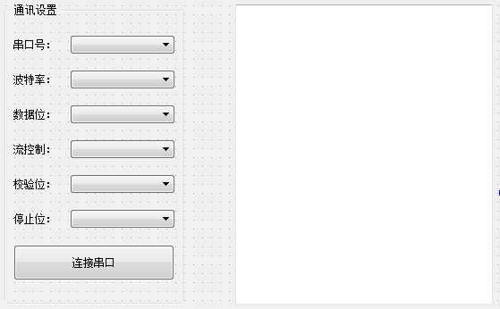

# Qt5 串口通信

```
QT +=serialport
```


```
mainwindow.h

#include <QMainWindow>
#include <QSerialPort>
#include <QSerialPortInfo>
#include <QDebug>

namespace Ui {
class MainWindow;
}

class MainWindow : public QMainWindow
{
    Q_OBJECT

public:
    explicit MainWindow(QWidget *parent = 0);
    ~MainWindow();

private slots:
    void on_pbLink_clicked();
	void receiveInfo(); // 接收数据
private:
    Ui::MainWindow *ui;
    QStringList getSerialNameList(); // 获取本地串口的列表
    void openSerial();   // 打开串口
    void closeSerial();  // 关闭串口
    QSerialPort * serialPort;
};
```

mainwindow.cpp

```
#include "mainwindow.h"
#include "ui_mainwindow.h"

MainWindow::MainWindow(QWidget *parent) :
    QMainWindow(parent),
    ui(new Ui::MainWindow)
{
    ui->setupUi(this);

    serialPort = new QSerialPort(this);
    connect(serialPort,SIGNAL(readyRead()),this,SLOT(receiveInfo()));
    
    // 串口列表
    QStringList serialNameList = getSerialNameList() ;
    ui->cbSerialName->addItems(serialNameList);
    
    // 波特率列表
    QStringList serialBaudList ;
    serialBaudList << "1200" << "2400" << "4800" << "9600"
                   <<  "19200" << "38400" << "57600" << "115200" ;
    ui->cbBaudRate->addItems(serialBaudList);
    ui->cbBaudRate->setCurrentText("9600");
    
    // 数据位
    QStringList serialDataBitList;
    serialDataBitList << "5" << "6" << "7" << "8" ;
    ui->cbDataBit->addItems(serialDataBitList);
    ui->cbDataBit->setCurrentText("8");
    
    // 控制流
    QStringList serialFlowControlList;
    serialFlowControlList << "无流控" << "硬件流控" << "软件流控" ;
    ui->cbFlowControl->addItems(serialFlowControlList);
    
    // 校验位
    QStringList serialParityList;
    serialParityList << "无校验" << "奇校验（odd）" << "偶校验（even）"
                     << "固定1（mark）" << "固定0（space）";
    ui->cbParity->addItems(serialParityList);
    
    // 停止位
    QStringList serialStopList;
    serialStopList << "1" << "1.5" << "2" ;
    ui->cbStop->addItems(serialStopList);

}


QStringList MainWindow::getSerialNameList()
{
    QStringList serialNameList;
    foreach(const QSerialPortInfo &info,QSerialPortInfo::availablePorts())
    {
        serialNameList << info.portName();
    }
    return serialNameList;
}

MainWindow::~MainWindow()
{
    delete ui;
}

void MainWindow::on_pbLink_clicked()
{
    if(ui->pbLink->text() == "连接串口")
    {
        ui->pbLink->setText("关闭串口");
        openSerial();
    }else if(ui->pbLink->text() == "关闭串口")
    {
        ui->pbLink->setText("连接串口");
        closeSerial();
    }
}


void MainWindow::openSerial()
{
    serialPort->setPortName(ui->cbSerialName->currentText());  // 设置串口名

    if(serialPort->isOpen())
    {
        serialPort->clear();
        serialPort->close();
    }
    
    / 设置波特率
    int baudRate = ui->cbBaudRate->currentText().toInt();
    switch (baudRate) {
    case 1200:
        serialPort->setBaudRate(QSerialPort::Baud1200,QSerialPort::AllDirections);//设置波特率和读写方向
        break;
    case 2400:
        serialPort->setBaudRate(QSerialPort::Baud2400,QSerialPort::AllDirections);//设置波特率和读写方向
        break;
    case 4800:
        serialPort->setBaudRate(QSerialPort::Baud4800,QSerialPort::AllDirections);//设置波特率和读写方向
        break;
    case 9600:
        serialPort->setBaudRate(QSerialPort::Baud9600,QSerialPort::AllDirections);//设置波特率和读写方向
        break;
    case 19200:
        serialPort->setBaudRate(QSerialPort::Baud19200,QSerialPort::AllDirections);//设置波特率和读写方向
        break;
    case 38400:
        serialPort->setBaudRate(QSerialPort::Baud38400,QSerialPort::AllDirections);//设置波特率和读写方向
        break;
    case 57600:
        serialPort->setBaudRate(QSerialPort::Baud57600,QSerialPort::AllDirections);//设置波特率和读写方向
        break;
    case 115200:
        serialPort->setBaudRate(QSerialPort::Baud115200,QSerialPort::AllDirections);//设置波特率和读写方向
        break;
    default:
        serialPort->setBaudRate(QSerialPort::UnknownBaud,QSerialPort::AllDirections);//设置波特率和读写方向
        break;
    }
    
    //设置数据位
    int dataBit = ui->cbDataBit->currentText().toInt();
    switch (dataBit) {
    case 5:
        serialPort->setDataBits(QSerialPort::Data5); //数据位为5位
        break;
    case 6:
        serialPort->setDataBits(QSerialPort::Data6); //数据位为6位
        break;
    case 7:
        serialPort->setDataBits(QSerialPort::Data7); //数据位为7位
        break;
    case 8:
        serialPort->setDataBits(QSerialPort::Data8); //数据位为8位
        break;
    default:
        serialPort->setDataBits(QSerialPort::UnknownDataBits);
        break;
    }
    
    /// 设置流控制
    QString flowControlStr = ui->cbFlowControl->currentText();
    if(flowControlStr == "无流控" )
        serialPort->setFlowControl(QSerialPort::NoFlowControl);//无流控制
    else if(flowControlStr == "硬件流控" )
        serialPort->setFlowControl(QSerialPort::HardwareControl);//硬件流控
    else if(flowControlStr == "软件流控")
        serialPort->setFlowControl(QSerialPort::SoftwareControl);//硬件流控
    else
        serialPort->setFlowControl(QSerialPort::UnknownFlowControl);
    
    /// 设置校验位
    QString parityStr = ui->cbParity->currentText();
    if(parityStr == "无校验" )
        serialPort->setParity(QSerialPort::NoParity);	//无校验位
    else if(parityStr == "奇校验（odd）" )
        serialPort->setParity(QSerialPort::OddParity);	//奇校验
    else if(parityStr == "偶校验（even）")
        serialPort->setParity(QSerialPort::EvenParity);	//偶校验
    else if(parityStr == "固定1（mark）" )
        serialPort->setParity(QSerialPort::MarkParity);	//固定为1
    else if(parityStr == "固定0（space）")
        serialPort->setParity(QSerialPort::SpaceParity);	//固定为0
    else
        serialPort->setParity(QSerialPort::UnknownParity);
    
     设置停止位
    QString stopBitsStr = ui->cbStop->currentText();
    if(stopBitsStr == "1")
        serialPort->setStopBits(QSerialPort::OneStop);  //一位停止位
    else if(stopBitsStr == "1.5")
        serialPort->setStopBits(QSerialPort::OneAndHalfStop);  //1.5
    else if(stopBitsStr == "2")
        serialPort->setStopBits(QSerialPort::TwoStop);  //2
    else
        serialPort->setStopBits(QSerialPort::UnknownStopBits);


    if(!serialPort->open(QIODevice::ReadWrite))
    {
        ui->textEdit->append("---> 打开串口连接失败" );
        return ;
    }else
    {
        ui->textEdit->append("---> 打开串口连接成功" );
    }

}

void MainWindow::closeSerial()
{
    if(serialPort->isOpen())
    {
        serialPort->clear();
        serialPort->close();
        ui->textEdit->append("---> 关闭串口连接" );
    }
}

void MainWindow::on_pbLink_clicked()
{
    if(ui->pbLink->text() == "连接串口")
    {
        ui->pbLink->setText("关闭串口");
        openSerial();
    }else if(ui->pbLink->text() == "关闭串口")
    {
        ui->pbLink->setText("连接串口");
        closeSerial();
    }
}

void MainWindow::receiveInfo()
{
     QByteArray data  = serialPort.readAll();
}
```
————————————————

版权声明：本文为CSDN博主「FlyingO123」的原创文章，遵循CC 4.0 BY-SA版权协议，转载请附上原文出处链接及本声明。

原文链接：https://blog.csdn.net/chenyitao736866376/article/details/119932718