# Qt6安装教程——国内源

为什么离线包没了？

> Qt6开始非商业授权下，不再提供离线安装方式的exe，但源码安装费时费力，所以推荐安装方式已经为在线组件安装方式，包括vs2022、Qt在线安装工具已经成为开发工具新的安装趋势。
>

Qt是不是要放弃开源？

NO。

> KDE 社区和 Qt 公司之间曾经达成过一项协议，其中规定：如果 Qt 公司在开源许可证有效的情况下停止开发自由软件版本的 Qt（Qt Free Edition），那么基金会有权以 BSD 许可证或其他开源许可证发布 Qt。当然这项协议最早为了防止qt公司倒闭，KDE可以继续延续不至于夭折。所以qt公司可以限制某些功能是付费是商业许可，但始终得保持开源分支。
>

备注：KDE又是谁，见文章末尾；

为什么要在线安装？

> 一、网速已经不是瓶颈；
>
> 二、开发工具要兼容更多群体和语言、功能，那体积势必越来越大。
>
> 以vs2022离线包为例，全包大小约25G，全包安装不现实也会浪费用户更多空间，而在线安装可以完美解决定制化需求。简单来说，vs2022做C++的只需要勾选对应项目不用安装c#等；qt也一样，qt做安卓的就勾选Android，不用的就完全不用勾选，定制化安装既可以节省下载时间和用户磁盘空间，还可以做到安装完成后灵活的更新、添加、删除组件。
>

Qt6公司在芬兰，如果采用官方安装方式则又必须能访问谷歌，网络又成为在线安装的“滑铁卢”。伴随信创国产化加快，qt也在国内迎来春天，2021年qt还在上海成立了官方办事处。国内越来越多的linux源已经开始加入了qt支持，比如阿里源、清华源等，鉴于有了高速的本地化国内源，又有了快的网速，Qt在线安装终于可以一气呵成了。

是时候本地化源在线安装了，以国内源为例，演示下在线安装流程：

 1、在国内源上下载qt在线安装工具（工具更新版本期间源上可能临时没有）；

备注：为方便大家使用可直接阿里云盘下载，会一直更新，可收藏或者关注 

```
阿里云盘不限速下载地址  https://www.aliyundrive.com/s/jWM9YtFb7jU
https://www.aliyundrive.com/s/jWM9YtFb7jU

NJU Mirror
https://mirrors.nju.edu.cn/qt/official_releases/online_installers/
```

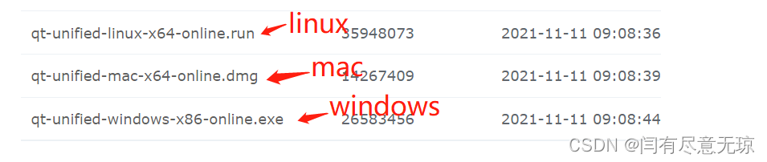

2、将下载好的在线安装工具，放到C盘根目录，打开windows Powershell，输入命令

2.1 切换到根路径
```
cd /

2.2 执行命令并指定源

./文件名 --mirror https://mirror.nju.edu.cn/qt

备注：文件名取决于你下载的在线安装工具名，mirror前面是两个-
```

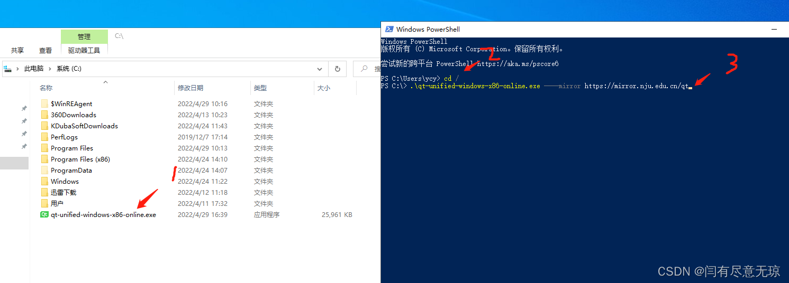

如果输入不对，或者-的数量不对，会提示“unknown option”，此时打开安装界面也不行，需自行关闭即可。

必须是下图所示，没任何提示且自动打开了安装界面；

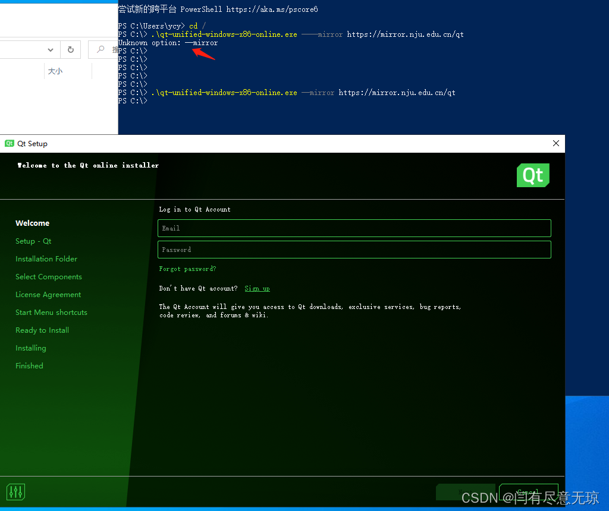

3、输入注册账号邮箱和密码，没有点Sign up按钮注册去；

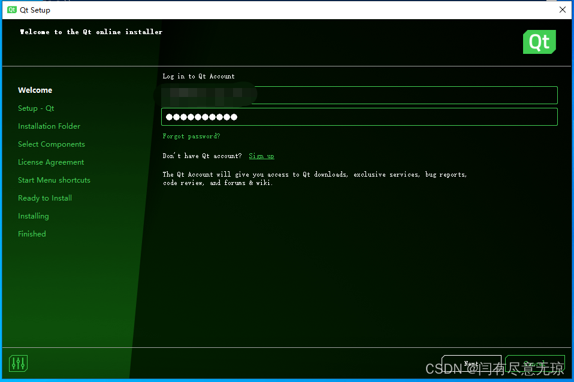

4、勾选协议，第二个，勾选意思是，非商业用户；

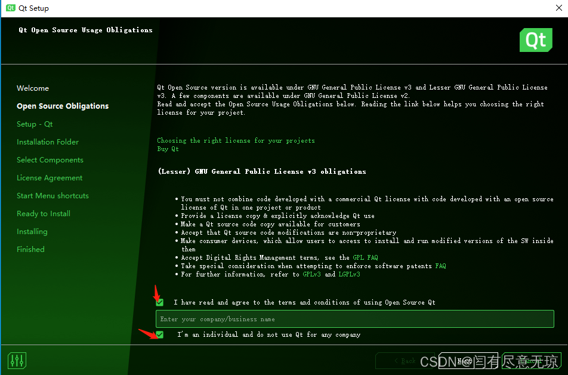

5、不发送反馈；

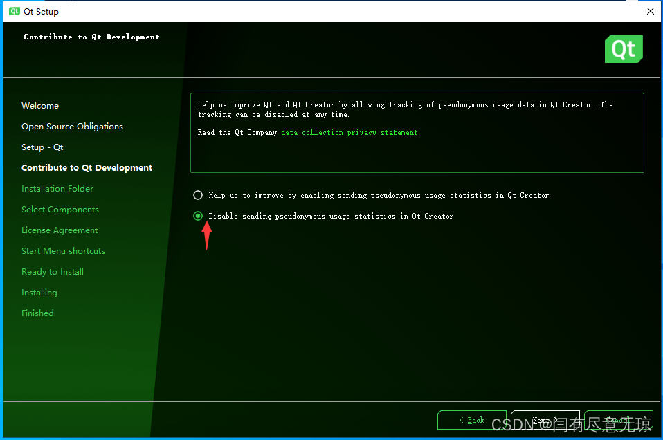

6、此时可以选择安装路径，qt完全支持安装在任意路径下，但建议只改变盘符，比如c改为d等；

安装方式选择“custom installation”，这样用户自行勾选安装组件；

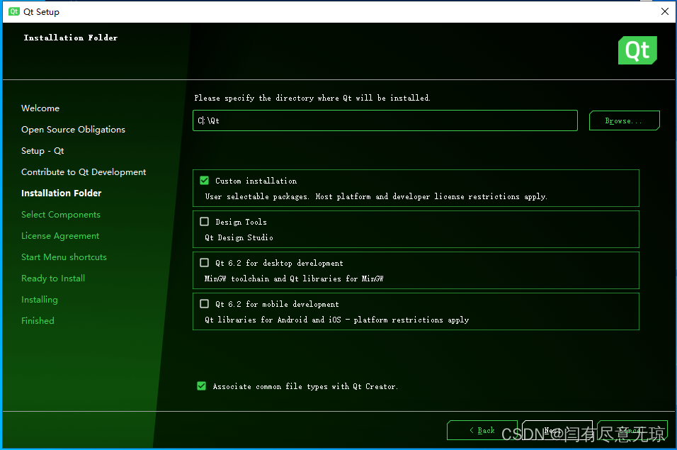

7、勾选组件，解释如图片下描述；

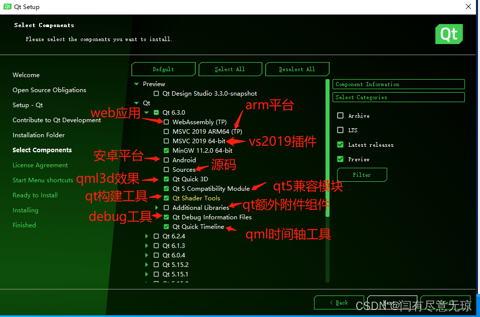

源码一般不需要，web应用和arm还在技术预览阶段一般不需要，额外附加组件一般不需要(比如pdf等)，qt quick timeline qml时间轴用于特效的，推荐以下勾选：

备注：有用组件未安装也不用担心，无论未安装或者已安装的组件，在安装完成后，都可以更新、添加和删除，在线安装的灵活就在这里体现；

8、建议选择最后一个 LGPL协议；

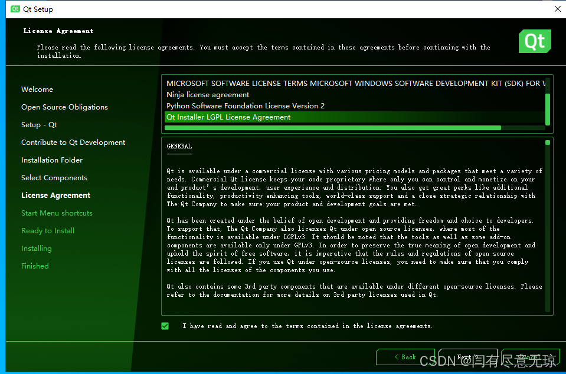

 9、qt开始下载，视网速决定，因为这个源是千兆的，所以下载是你宽带满速；

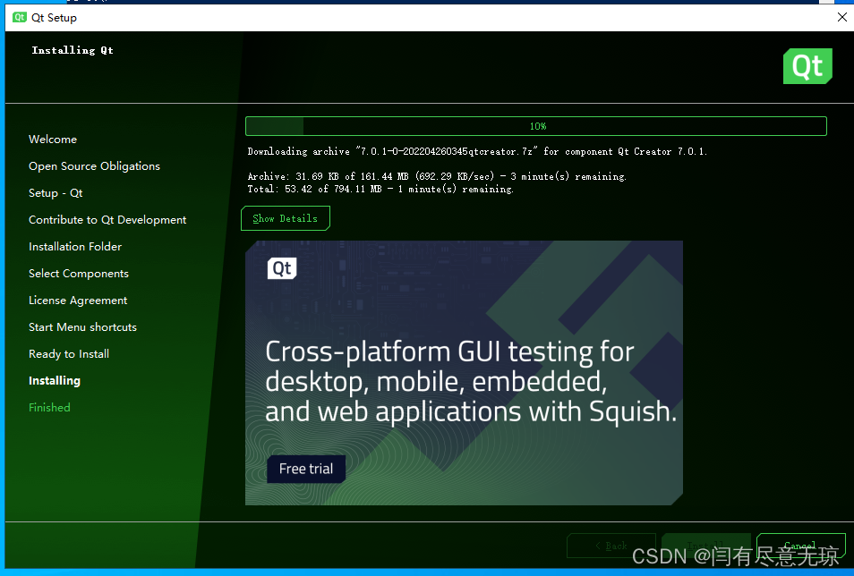

10、安装完成后，如下图；

第一个默认打勾，是个说明文档，可以取消勾选；

第二个勾选，是Qt Design Studio，它其实就是qt5时代的Qt Quick designer，qml风格的设计器，自qt6开始，qt决定分离它，目标是设计ui的人只需要安装Qt Design Studio，而不需要安装qt creator。

（图片下方链接是关于Qt Design Studio单独安装文章，有兴趣可阅读）

第三个勾选，就是打开qt creator。

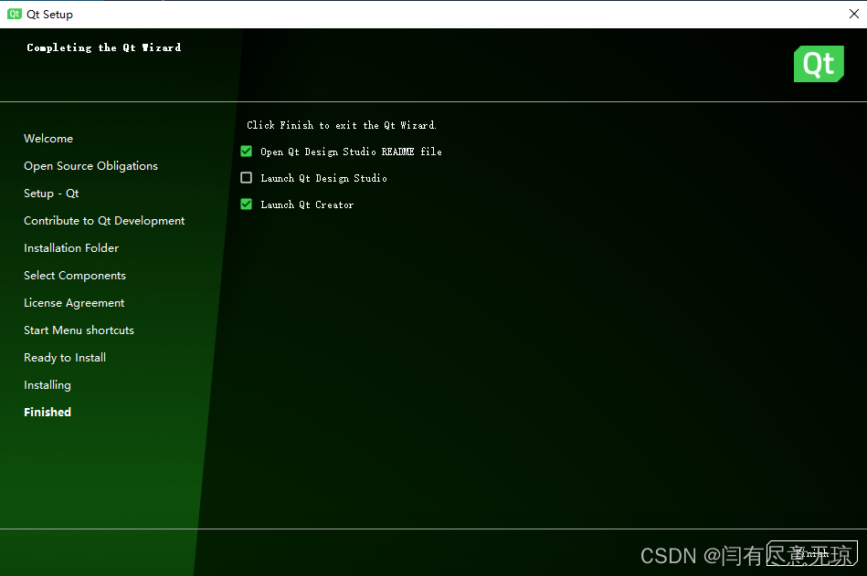

```
(19条消息) Qt Quick Designer灰色或者禁用_闫有尽意无琼的博客-CSDN博客
https://blog.csdn.net/yanchenyu365/article/details/124443311
```
```
Qt Design Studio安装教程_闫有尽意无琼的博客-CSDN博客
断网安装，不需要的登录用户账户；3、安装后打开如下图；4、新建项目，拖出控件，可直接运行；5、此处还提供一个仪表范例；总结：使用后感觉该工具是一个适用于ui设计人员专用的工具；...
https://blog.csdn.net/yanchenyu365/article/details/124429701
```

11、打开qt creator，新建，项目，测试即可。

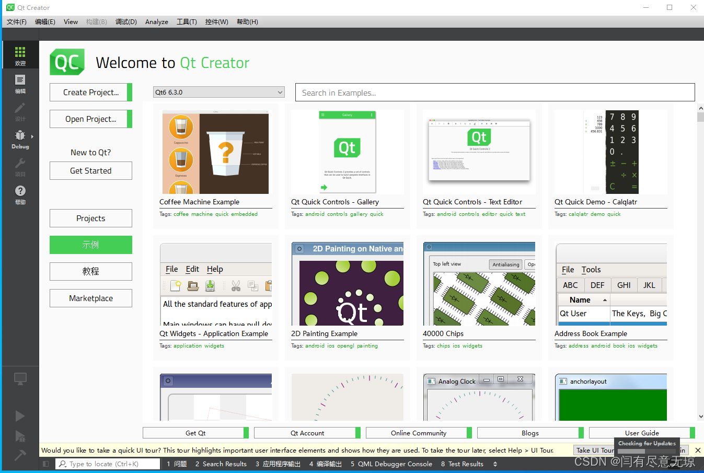

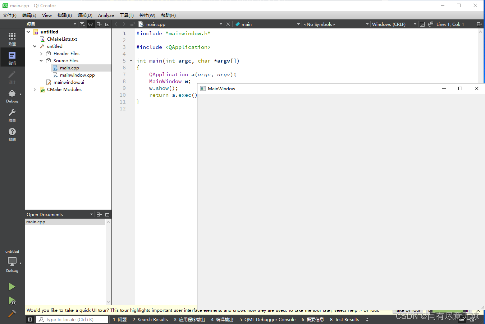

 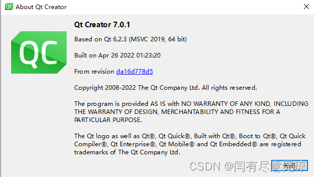

> QT和KDE
> Kool Desktop Environment (KDE)，KDE社区是世界上最大、最具影响力的自由软件社区之一，拥有众多的贡献者和用户。之前提到 Qt 原本是商业授权软件，是怎么开源的呢？这就涉及 Qt 和 KDE 的纠葛了。 KDE 是 Linux 操作系统的桌面环境，与 GNOME 桌面是类似的，作为开源桌面它们竞争的情况更为多见。 KDE 是采用 GPL 许可证发布的开源软件，而最初 Qt 是商业授权的，存在商业侵权风险， GNOME 则是基于开源 GTK 库的，没有什么商业风险，这一度是 GNOME 优越于 KDE 的特性。 由于 Qt 的商业授权，KDE 社区一度混乱纠结，与此同时 GNOME 则如火如荼发展起来了。 KDE 毕竟算是亲儿子，被另一波人欺负，奇趣科技公司当然看不下去了， 最后是奇趣科技公司为了赢得开发者的支持，为 Qt 增加了 GPL 的开源授权， 对于开源社区而言，遵循 GPL 使用 Qt 就不需要付费，这为 KDE 解决了燃眉之急。 之后 KDE 桌面和 GNOME 都发展壮大起来，都做得越来越好了。 

闫有尽意无琼

————————————————

版权声明：本文为CSDN博主「闫有尽意无琼」的原创文章，遵循CC 4.0 BY-SA版权协议，转载请附上原文出处链接及本声明。

原文链接：https://blog.csdn.net/yanchenyu365/article/details/124499087