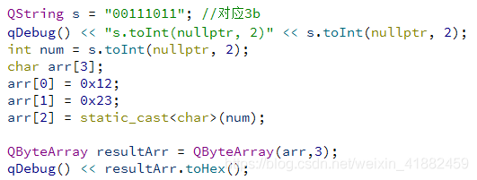
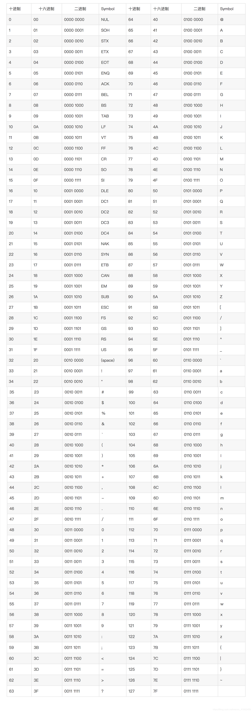

# Qt二进制转换写入char数组，char转换为二进制字符串

1.二进制类型的字符串转换

```
QString s="00111011";

s.toInt(nullptr,2);//表示二进制字符串转换为10进制
```

具体方法参考图片



2.char转换为二进制字符串
```
ch a =0x39;

QString s = QString("%1").arg(QString::number(ch,2),sizeof(ch)*8,'0');//'0'表示高位用0去占位，2表示2进制。sizeof(ch)*8,表示长度为8。         意义：将字符转换为2进制的字符串.
```

3.QByteArray16进制转10进制

```
QByteArray a;

a.resize(2);

a[0]=0x0c;

a[1]=0xd5;

QByteArray tmp(a.toHex());

int num = tmp.toInt(nullptr,16);//转换为int    num=3285;
```

4.QString转换为QByteArray字节数组
```
QString str("hello");

QByteArray bytes = str.toUtf8(); // QString转QByteArray方法1

QString str("hello");

QByteArray bytes = str.toLatin1(); // QString转QByteArray方法2
```

5.QByteArray字节数组转字符串
```
QString str = QString::fromUtf8(data);
```

6.将16进制的字符串35转换为16进制的0x35

```
QString str ="35";

char ch = str.toUShort(nullptr,16);//ch==0x35;
```

7.Int转换为char数组
```
int freq  = 100;
QString freqStr = QString("%1").arg(freq,4,16,QLatin1Char('0'));
int num1 = freqStr.mid(0,2).toInt(nullptr,16);//H
int num2 = freqStr.mid(0,2).toInt(nullptr,16);//L
```

小数可以先转换为整数处理

8.float与16进制的相互转换
```
void Format::floatThex(bool bigEndian)
{
    QString strFloat = ui->float_hex1->text();
    float f = strFloat.toFloat();
    int i = *((int *)&f);
    QString float2 = QString("%1").arg(i,8,16,QLatin1Char('0'));
    QString step =float2;
//此处是小端
if(bigEndian)
    float2 = step.left(4)+float2.right(4);
else
    float2 = float2.right(4)+step.left(4);
    ui->hex_float1->setText(float2);
}
void Format::hexTfloat(bool bigEndian)
{
    QString strHex = ui->hex_float1->text();
    QString step = strHex;
if(bigEndian)
    strHex= strHex.left(4)+strHex.right(4);
else    
    strHex = strHex.right(4)+step.left(4);
    int c = hexToDec(strHex).toInt();
    float d = *(float*)&c;
    QString radiation = QString("%1").arg(d);
    ui->float_hex1->setText(radiation);
}
```

注意：

```
QString str ="01010110";

int a = str.toInt(nullptr,2);//将二进制的str转换为Int类型

QByteArray::number(str.toInt(nullptr,2),16)；//转换为16进制  但是结果是qbytearray

 

QByteArray a;

a.resize(1);

a[0]=(char)QByteArray::number(str.toInt(nullptr,2),16)；//这个转换结果是对的 只是有可能打印的是symbol，
```


贴一个对应表  因为有可能自己显示的是正确的  只是打印出来的结果不对而已。



————————————————

版权声明：本文为CSDN博主「枫影竹韵」的原创文章，遵循CC 4.0 BY-SA版权协议，转载请附上原文出处链接及本声明。

原文链接：https://blog.csdn.net/weixin_41882459/article/details/106232163