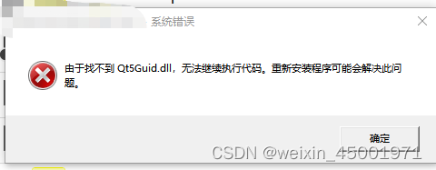
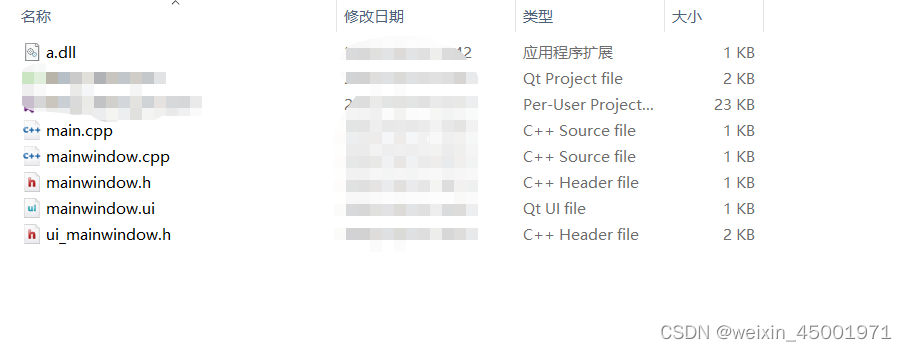
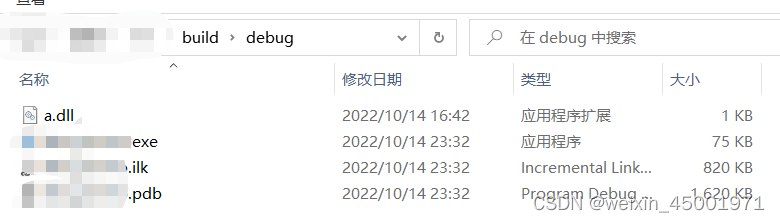
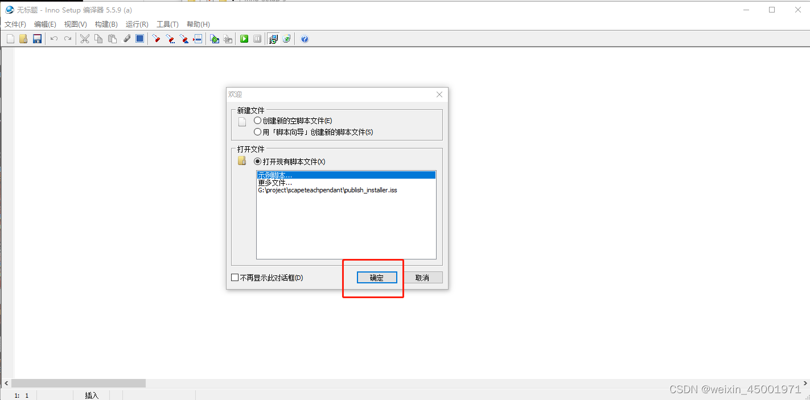
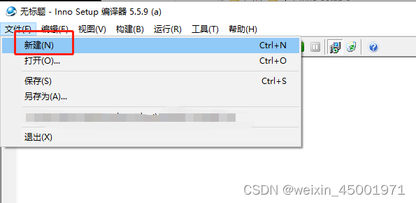
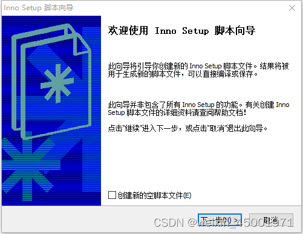
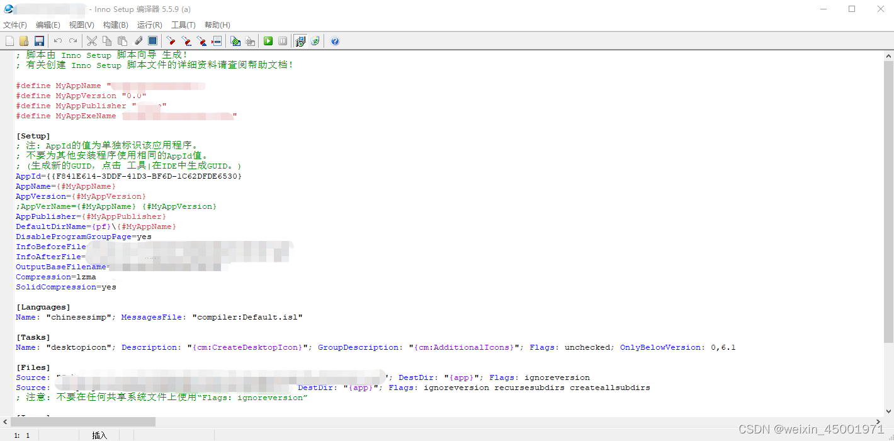
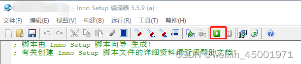

# Qt发布安装程序(打包依赖库+生成安装程序)

## 目录

- 打包Qt依赖库
- 打包其它依赖库
- 生成安装程序
- 下载并安装Inno Setup 5
- 使用Inno Setup 5

Qt编译好的项目是不能直接被双击运行的，如下所示。



缺少了依赖的库，需要添加进去。

## 打包Qt依赖库

Qt提供了可以打包依赖的Qt库的工具，名叫windeployqt.exe，可以在编译器目录下的bin找到，例如我的windeployqt.exe所在路径为 D:\xxx\qt\5.14.2\msvc2017_64\bin。
进入命令行执行
```
./windeployqt.exe xxx.exe
```
即可完成打包，要注意的是，执行以上命令时，所在的运行路径必须是在bin，不然会打包失败。

## 打包其它依赖库

项目中往往会用到其它的第三方库，这些库用Qt的工具是无法打包的，我们可以添加脚本程序来自行打包。
例，项目依赖了一个a.dll，如图所示



需要一个脚本将他复制到应用程序目录下，可以使用批处理完成该功能，如下。
```
@echo off
echo yes | xcopy ..\src\a.dll %1
```
把命令行传参下标为1的参数作为目标路径，将a.dll复制过去。

Qt的pro文件提供了编译后自动执行命令的功能，在pro文件中加入以下内容。
```
DESTDIR += $${PWD}/../build/debug
QMAKE_POST_LINK += $${PWD}/pack.bat $${DESTDIR}
```
指定应用程序生成路径为源码目录的…/build/debug，然后设置编译后自动执行写好的脚本。
编译程序时会发现脚本报错，提示xcopy的参数不对，原因是Qt里的路径只能用左斜杠“/”，而xcopy需要传入右斜杠“\”的路径，所以需要把斜杠转换以下。
参考：https://cloud.tencent.com/developer/ask/sof/1124521/answer/1571952
在脚本中添加斜杠转换
```
@echo off

set build_path=%~1
set build_path=%build_path:/=\%
for %%F in ("%build_path%*.nc") do (
	if "%build_path:~-1%" neq "\" set "build_path=%build_path%\"
)

echo yes | xcopy ..\src\a.dll %build_path%
```
重新编译，此时在build/debug目录中既有应用程序，又有所依赖的dll。



## 生成安装程序

本文介绍使用Inno Setup 5生成安装程序的方法。

### 下载并安装Inno Setup 5

参考：https://blog.csdn.net/itas109/article/details/78801199
中文安装包：http://download.csdn.net/download/itas109/10158202
下载好之后双击点开，选好安装路径后，一直下一步即可。

### 使用Inno Setup 5

双击打开Inno Setup


进入以下界面，点击确定。



点击菜单栏的新建。



进入到脚本向导。



后续根据提示填写即可，完成向导后会生成一个.iss脚本文件。



将它保存到指定目录，然后点击“运行”，就可以开始构建安装程序了。



如果在向导中没有指定输出目录，安装程序会默认放在脚本的同级目录下的Output文件夹内。


————————————————

版权声明：本文为CSDN博主「weixin_45001971」的原创文章，遵循CC 4.0 BY-SA版权协议，转载请附上原文出处链接及本声明。

原文链接：https://blog.csdn.net/weixin_45001971/article/details/127323133