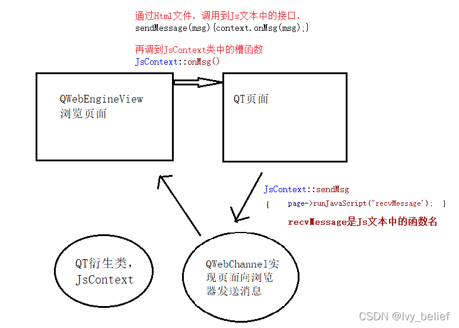
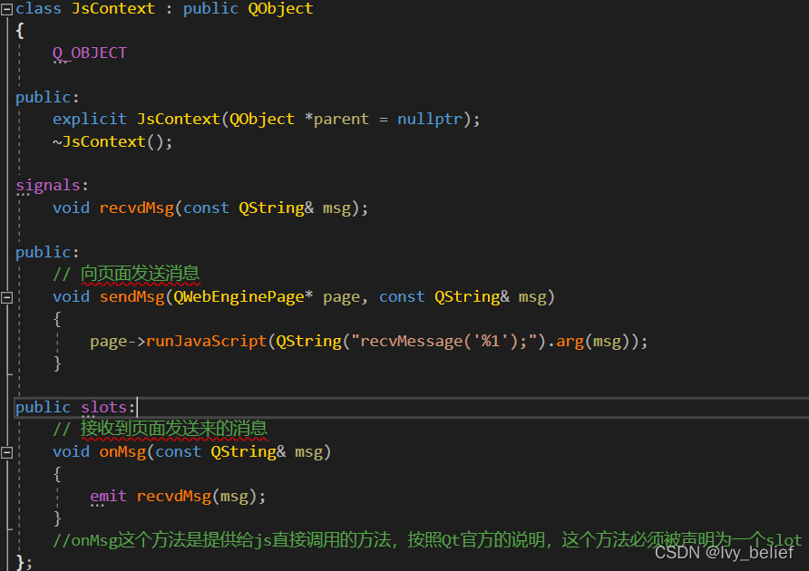
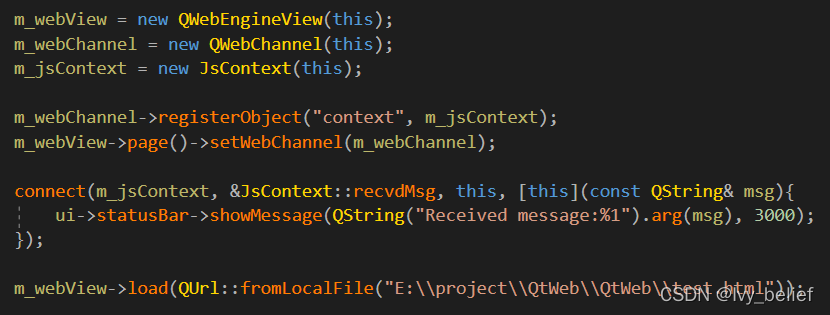
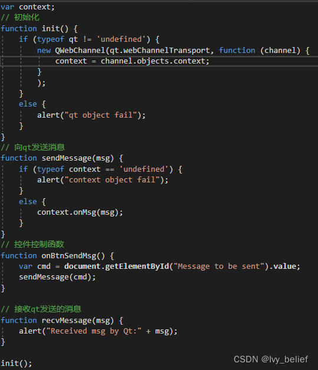
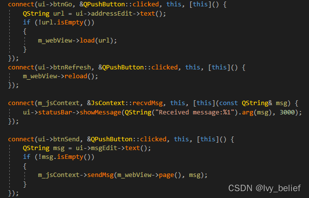
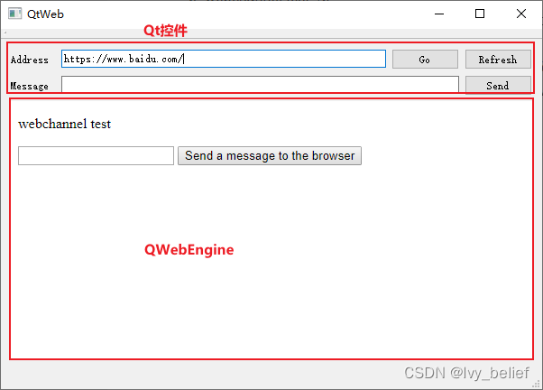

# Qt嵌入浏览器—QWebEngineView实现浏览器基本功能（内含代码例子）

要求：Qt升级到5.7.1之后，前面的Qt版本有bug(在刷新页面后，页面会丢失window.qt对象)

1、所需功能模块：

用到Qt的模块：QWebEngineView、QWebChannel

自己衍生出一个Js模块：JsContext（继承于QObject）

2、简单介绍下模块的功能：

（1）QWebEngineView，web view是Qt WebEngine web浏览模块的主要组件。它可以在各种应用程序中显示来自互联网的实时web内容。

（2）QWebChannel：为了实现页面向浏览器发送消息，需要在一定程度上实现在页面中访问Qt对象。（Qt官方的推荐方式）

填补了c++应用程序和HTML/JavaScript应用程序之间的空白。不需要手动传递消息和序列化数据，c++端上的属性更新和信号发射会自动传输到可能远程运行的HTML客户机。在客户端，将为任何发布的c++ QObject创建一个JavaScript对象。

它反映了c++对象的API，因此可以直观地使用。

唯一的限制是HTML客户机支持qwebchannel.js使用的JavaScript特性。因此，基本上可以与任何现代HTML浏览器或独立的JavaScript运行时(如node.js)进行交互。

借助官方提供的qwebchannel.js脚本，可以很方便地实现页面对Qt对象的调用，同时便于实现C++和html/js的解耦，方便使用不同技术栈的开发人员的分工。

注：qwebchannel.js在Qt发布版的文件夹下可以找到。（找出放置与XXX.html文件同一级目录，否则容易关联不到QWebChannel）

（3）通过JsContext，webCommunication 这个实现web site与客户端进行交互。

3、梳理下几者之间的关系



4、代码（话不多说，直接上代码）

（1）先设计一个JsContext类



（2）在主程序中定义三个变量

    QWebEngineView *m_webView = nullptr;
    QWebChannel *m_webChannel = nullptr;
    JsContext *m_jsContext = nullptr;



步骤：

m_webChannel

1)创建QWebChannel对象;

2)向QWebChannel对象注册Qt对象。 例子里的Qt对象就是上面实现的JsContext对象。

注意：这里注册时所用的名字“context”，就是js获取qt对象时所使用的索引名。

3)将设置好的QWebChannel对象设置为当前页面的通道。即调用QWebEnginePage的setWebChannel方法。

m_webView

m_webView->load(QUrl::fromLocalFile("E:\\project\\QtWeb\\QtWeb\\test.html"));

此路径就是一个HTML的页面路径；

（3）准备一个test.js文件，以及test.html



```
<!DOCTYPE html>

<html lang="en">

<head>

    <meta charset="UTF-8">
    
    <title>webchannel</title>

</head>

<body>

    <meta charset="UTF-8">
    
    <p>webchannel test</p>
    
    <script type="text/javascript" src="./qwebchannel.js"></script>
    
    <script type="text/javascript" src="./test.js"></script>
    
    <input id="Message to be sent" type="text" name="msgText" />
    
    <input type="button" value="Send a message to the browser" οnclick="onBtnSendMsg()" />

</body>

</html>
```


5、交互相关的代码



6、呈现的结果是：



————————————————

版权声明：本文为CSDN博主「Ivy_belief」的原创文章，遵循CC 4.0 BY-SA版权协议，转载请附上原文出处链接及本声明。

原文链接：https://blog.csdn.net/bigger_belief/article/details/123250851