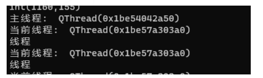
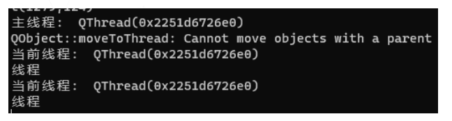

# Qt源码分析之moveToThread

2023-04-04 14:59·[音视频开发老舅](https://www.toutiao.com/c/user/token/MS4wLjABAAAArcRDfoeW20L3LFr0qZLmYl4QqPirxBF6rA_RG0DNF4IEoS2w9c83yB4SnK7oIiwA/?source=tuwen_detail)

这一次，我们来看Qt中关于将一个QObject对象移动至一个线程的函数moveToThread

# 1、Qt使用线程的基本方法

首先，我们简单的介绍一下在Qt中使用多线程的几种方法:

1. 重写QThread的run函数，将要在多线程执行的任务放到run函数里

```
/*mythread.h*/
#pragma once

#include <QThread>

class MyThread  : public QThread
{
    Q_OBJECT

public:
    explicit MyThread(QObject* parent = nullptr);
    ~MyThread();

protected:
    void run() override;
};

/*mythread.cpp*/
#include "mythread.h"
#include <QDebug>

MyThread::MyThread(QObject* parent)
    : QThread(parent)
{}

MyThread::~MyThread()
{}

void MyThread::run()
{
    /*
        在这个函数里执行耗时操作
    */
   for (auto a = 0; a < 10; a++) {
       qDebug() << u8"线程";
       QThread::sleep(1);
   }
}

/*调用函数*/
auto m_thread = new MyThread();
// 调用start之后，就会去执行run里内容了
m_thread->start();
```

但是这种方法，不被Qt官方所推荐，Qt官方所推荐的是将对象移动至线程的方法moveToThread

1. 创建一个QThread对象，将对象移动至一个线程中，用信号槽的方式来触发该对象的槽函数，此时槽函数是在线程中执行的

```
/*mytask.h*/
#pragma once

#include <QObject>

class MyTask  : public QObject
{
    Q_OBJECT

public:
    MyTask(QObject *parent = nullptr);
    ~MyTask();

public slots:
    void slotMyTask();
};

/*mytask.cpp*/
#include "mytask.h"
#include <QThread>
#include <QDebug>

MyTask::MyTask(QObject *parent)
    : QObject(parent)
{}

MyTask::~MyTask()
{}

void MyTask::slotMyTask()
{
    /* 在这里执行耗时操作 */
    for (auto a = 0; a < 10; a++) {
        qDebug() << u8"当前线程: " << QThread::currentThread();
        qDebug() << u8"线程";
        QThread::sleep(1);
    }
}


/*使用方法*/
// 1. 创建任务对象以及线程对象
auto m_task = new MyTask();
auto* m_thread = new QThread();

// 2. 将任务对象移动至线程
m_task->moveToThread(m_thread);

// 3. 将信号与任务类的槽连接起来
connect(m_thread, &QThread::started, m_task, &MyTask::slotMyTask);

//  4. 开启线程
m_thread->start();
```




Note:
这里有一个坑，那就是如果一个QObject对象是有父对象的，那么该对象，就不能被移动至线程。测试代码如下：

```
// 1. 创建一个有父对象的任务对象以及线程对象
auto m_task = new MyTask(this);
auto* m_thread = new QThread();

// 2. 将任务对象移动至线程
m_task->moveToThread(m_thread);

// 3. 将信号与任务类的槽连接起来
connect(m_thread, &QThread::started, m_task, &MyTask::slotMyTask);

//  4. 开启线程
m_thread->start();
```

此时，我们看到控制台会输出：

> Cannot move objects with a parent (无法移动一个有父对象的object)




并且，我们能看到槽函数里打印的线程为**主线程**。

1. 使用Qt的QtConcurrent，缺点之一是没有办法手动退出

```
// 使用这个，需要在头文件里引入
#include <QtConcurrent/QtConcurrent>

// 定义一个任务函数
int MainWindow::taskTest(int a)
{
    for (auto i = 1; i < 10; i++) {
        qDebug() << "a: " << a;
        QThread::sleep(1);
    }

    return 0;
}

/* 使用方法 */
// 在函数后面跟上你要设置给函数的参数
QtConcurrent::run(this, &MainWindow::taskTest, 10);
```

注意：在Qt里，子线程不能进行任何的ui更新操作，ui的更新操作全部只能在主线程

> QT开发交流+赀料君羊：714620761

# 2、源码分析

然后，我们浅浅的分析一下，QObject中的moveToThread，主要分为三个部分

1. 对一些基本条件的判断:
2. 移动的对象是否已经在目标线程
3. 移动的对象是否有父对象(这就是我们上面说到的坑)
4. 不能将一个窗口对象移动至其他线程，因为Qt要求所有UI操作都必须在主线程中执行，线程中如果想要更新UI，需要用信号槽来通知界面进行更改。

```
// 当前对象已经在目标线程了
    if (d->threadData.loadRelaxed()->thread.loadAcquire() == targetThread) {
        // object is already in this thread
        return;
    }

	// 不能移动一个有父对象的对象
    if (d->parent != nullptr) {
        qWarning("QObject::moveToThread: Cannot move objects with a parent");
        return;
    }
	// 窗口部件不能移动到一个新的线程，在Qt里GUI操作只能在主线程
    if (d->isWidget) {
        qWarning("QObject::moveToThread: Widgets cannot be moved to a new thread");
        return;
    }
```

对要移动的对象当前所属线程的一些判断:

- 如果要移动的对象没有线程依附性，那么可以移动至目标线程
- 如果**移动操作所在线程与移动对象所在线程不一致**，那么不允许去移动

```
QThreadData *currentData = QThreadData::current();
QThreadData *targetData = targetThread ? QThreadData::get2(targetThread) : nullptr;
QThreadData *thisThreadData = d->threadData.loadRelaxed();
if (!thisThreadData->thread.loadAcquire() && currentData == targetData) {
    // 如果一个对象没有线程依附性，允许移动一个对象到一个线程
    // one exception to the rule: we allow moving objects with no thread affinity to the current thread
    currentData = d->threadData;
} else if (thisThreadData != currentData) {
    // 不能在不是对象的线程里，去移动该对象至另外一个对象
    qWarning("QObject::moveToThread: Current thread (%p) is not the object's thread (%p).\n"
             "Cannot move to target thread (%p)\n",
             currentData->thread.loadRelaxed(), thisThreadData->thread.loadRelaxed(), targetData ? targetData->thread.loadRelaxed() : nullptr);

#ifdef Q_OS_MAC
    qWarning("You might be loading two sets of Qt binaries into the same process. "
             "Check that all plugins are compiled against the right Qt binaries. Export "
             "DYLD_PRINT_LIBRARIES=1 and check that only one set of binaries are being loaded.");
#endif

    return;
}
```

正式的移动操作

```
    // prepare to move
    d->moveToThread_helper();

    if (!targetData)
        targetData = new QThreadData(0);

    // make sure nobody adds/removes connections to this object while we're moving it
    QMutexLocker l(signalSlotLock(this));

    QOrderedMutexLocker locker(¤tData->postEventList.mutex,
                               &targetData->postEventList.mutex);

    // keep currentData alive (since we've got it locked)
    currentData->ref();

    // move the object
    d_func()->setThreadData_helper(currentData, targetData);

    locker.unlock();

    // now currentData can commit suicide if it wants to
    currentData->deref();
```

# 3、线程和信 号槽使用心得

下面是一些多线程使用信号槽的一点小心得总结

1. 不能在子线程去更新UI界面，只能在**主线程进行更新**。
2. 可以通过信号槽连接，在子线程通知主线程去更新UI
3. 跨线程使用信号槽，建议用QueuedConnection，因为这种连接方式，Qt会把信号丢到事件循环里去，这样**槽函数会在接收者所在的线程执行**。而DirectConnection这种连接方式，因为是直接回调槽函数，槽会在信号发出的线程进行调用。具体可看上篇关于信号与槽源码分析。
4. 但是使用QueuedConnection这种连接方式，信号的参数如果是自己定义的类型，一定要记得使用qRegisterMetaType来进行注册，或者使用Q_DECLARE_METATYPE来进行注册。否则，槽函数将不会触发。
5. BlockQueuedConnection这种方法慎用，因为如果**信号发送者和接收者在同一个线程，将会导致死锁**。