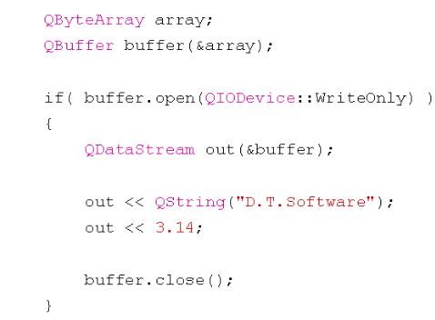

# Qt缓冲区操作与目录操作

# 1、缓冲区操作

**1、Qt中缓冲区的概念**

**（1）、缓冲区的本质为一段连续的存储空间**

**（2）、QBuffer是qt中缓冲区相关的类**

**（3）、在Qt中可以将缓冲区看做是一种特殊的IO设备**

**（4）、文件流辅助类（上节课那些）可以直接用于操作缓冲区**

**2、QBuffer的使用方式**




**3、QBuffer缓冲区的使用场合**

**（1）、在线程间进行不同类型的数据传递（将不同类型数据写到缓冲区对象里，然后把对象传递过去）**

**（2）、缓存外部设备中的数据返回**

**（3）、数据读取速度小于数据写入速度**

```
#include <QtCore/QCoreApplication>
#include <QBuffer>
#include <QDataStream>
#include <QDebug>
#include <QByteArray>
#include <QString>

//与文件一样都是IO操作，方式也类似
//1、文件需要QFile与一个实际文件相关联，缓冲区需要QBuffer与一片存储空间（QByteArray定义的）相关联
//2、文件的打开需要QFile的对象来打开，缓冲区的打开需要QBuffer的对象来打开
//3、写入和读出数据一般都需要QFile（或QBuffer）对象与QDataStream（或QTextStream）相关联
void write_buffer(int type, QBuffer& buffer)
{
    if(buffer.open(QIODevice::WriteOnly))//以只写二进制的形式打开
                    
    {                                   //可以写入不同类型的数据
        QDataStream out(&buffer);
        out << type;
        if(type == 0)
        {
            out << QString("D.T.Softwear");
            out << QString("3.14");
        }
        else if(type == 1)
        {
            out << 35;
            out << 55;
        }
        else if(type == 2)
        {
            out << 3.15;
        }

        buffer.close();
    }
}

void read_buffer(QBuffer& buffer)
{
    int type;
    if(buffer.open(QIODevice::ReadOnly))
    {
        QDataStream in(&buffer);

        in >> type;

        if(type==0)
        {
            QString s1 = "";
            QString s2 = "";
            in >> s1;
            in >> s2;
            qDebug() << s1;
            qDebug() << s2;

        }
        else if(type == 1)
        {
            int a = 0;
            int b = 0;
            in >> a;
            in >> b;
            qDebug() << a;
            qDebug() << b;
        }
        else if(type == 2)
        {
            double d = 0;
            in >> d;
            qDebug() << d;
        }
    }
}

int main(int argc, char *argv[])
{
    QCoreApplication a(argc, argv);
    
    QByteArray ba;

    QBuffer buffer(&ba);

    write_buffer(0, buffer);
    read_buffer(buffer);

    return a.exec();
}
QBuffer.cpp
```

# 2、目录操作

**1、QDir是Qt中功能强大的目录操作类**

**（1）、Qt中的目录分隔符统一使用‘/’**

**（2）、QDir能够对目录进行任意操作（创建、删除、重命名）**

**（3）、QDir能够能够获取指定目录中的所有条目和路径等（文件和文件夹）**

**（4）、QDir能够能够使用过滤字符串获取指定条目**

**（5）、QDir能够获取系统中的所有根目录**

**2、目录操作基础实例**


```
#include <QtCore/QCoreApplication>
#include <QDir>
#include <QFileInfo>
#include <QDebug>
#include <QString>
#include <QFileInfoList>
void dir_test(QString path)
{
    QDir dir(path);
    if(!dir.exists())
    {
        dir.mkdir(path);
    }
    if(dir.exists())
    {
        dir.cd(path);
        QStringList list = dir.entryList();
        for(int i=0; i<list.count(); i++)
        {
            qDebug() << list[i];
        }
    }
}

unsigned int countsize(QString path)//计算文件及文件夹大小
{
    unsigned int ret = 0;
    QFileInfo info(path);
    if(info.isFile())
    {
        ret = info.size();
    }
    else if(info.isDir())
    {
        QDir dir(path);
        //dir.cd(path);
        QFileInfoList list = dir.entryInfoList();//为了后面能取到绝对路径属性，这里返回属性列表

        for(int i=0; i<list.count(); i++)
        {
            if((list[i].fileName()!=".") && (list[i].fileName() != ".."))
            {
                ret += countsize(list[i].absoluteFilePath());//递归调用
            }
        }
    }
    return ret;
}

int main(int argc, char *argv[])
{
    QCoreApplication a(argc, argv);

    dir_test("F:/Qt/lesson34/testdir");

    qDebug()<<countsize("F:/Qt/lesson34/testdir");

    return a.exec();
}

QDir.cpp
```

# 3、文件系统监视器

**1、QFileSystemWatcher用于监控文件和目录的状态变化（内容、重命名、删除）**

**（1）、能够监控指定目录和文件的状态**

**（2）、能够同时对多个文件和目录进行监控**

**（3）、当目录或者文件发生改变时将触发信号**

**（4）、可以通过信号与槽的机制捕获信号并作出反应**

**2、文件监控实例**

> QT开发交流+赀料君羊：714620761


```
#ifndef WATCHER_H
#define WATCHER_H

#include <QObject>
#include <QFileSystemWatcher>
#include <QString>
#include <QDebug>

class Watcher : public QObject
{
    Q_OBJECT
private:
    QFileSystemWatcher m_watcher;
public:
    explicit Watcher(QObject *parent = 0);
    void addpath(QString path);
    
signals:
    
public slots:
    void directorychanged(const QString & path);
    void filechanged(const QString & path);
    
};

#endif // WATCHER_H

Watcher.h
#include "Watcher.h"

Watcher::Watcher(QObject *parent) :
    QObject(parent)
{
    /*********************2、连接信号与槽*****************************/   
    connect(&m_watcher, SIGNAL(fileChanged(const QString&)), this, SLOT(filechanged(const QString&)));
    connect(&m_watcher, SIGNAL(directoryChanged(const QString&)), this, SLOT(directorychanged(const QString&)));
}
/*********************1、定义槽函数*****************************/
void Watcher::directorychanged(const QString& path)
{
    qDebug() << "directorychanged";
}
void Watcher::filechanged(const QString& path)
{
    qDebug() << "filechanged";
}
/*********************3、加入受监控的文件或者目录*****************************/
void Watcher::addpath(QString path)
{
    m_watcher.addPath(path);
}

Watcher.cpp
#include <QtCore/QCoreApplication>
#include "Watcher.h"

int main(int argc, char *argv[])
{
    QCoreApplication a(argc, argv);
    Watcher w;
    w.addpath("F:/Qt/lesson34/QDir");
    return a.exec();
}

main.cpp
```

# 4、小结

**（1）、缓冲区的本质为一段连续的内存空间**

**（2）、在Qt中可以将缓冲区看做是一种特殊的IO设备**

**（3）、QDir提供了强大的目录操作支持**

**（4）、QFileSystemWatcher用于监控文件和目录的状态变化**