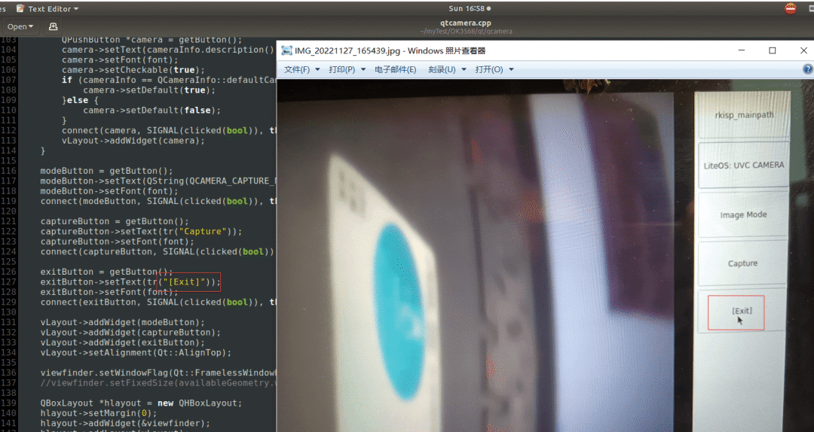

# RK3568！四核64位ARMv8.2A架构，汇聚编译源码及实战样例

本文进行飞凌OK3568-C开发板的结项测评，通过综合前面多篇测评的各个功能，构成一个智慧家居控制器综合项目。

[**开箱与基础功能详细测评**](https://bbs.elecfans.com/jishu_2318370_1_1.html)(点击标题查看全文)

开发板的SOC采用Rockchip的RK3568，RK3568为四核64位ARMv8.2A架构，22nm制程，主频最高可以达到2.0Ghz，支持三屏同显示或三屏异显，内置独立的1T算力NPN，主要定位应用于物联网网关、智能 NVR、工控平板、工业检测、工控盒、智慧城市、云终端、车载中控等行业定制市场。

[**RK3568源码编译与交叉编译环境搭建**](https://bbs.elecfans.com/jishu_2318416_1_1.html)(点击标题查看全文)

本节对OK3568-C Linux系统开发需要用的软件交叉编译环境的配置。

对于软件开发，如果只是使用C/C++代码，则在自己的虚拟机中添加RK3568对应的交叉编译器(gcc/g++)即可，如果要进行Qt开发，则还要再交叉编译Qt源码，一种解决方法是直接编译RK3568的源码，编译完成之后，会包含有Qt的编译结果，使用RK3568源码编译的成果物，就可用进行Qt开发了。下面就介绍这两种交叉编译环境的配置方法。

[**Qt开发一个音乐播放器**](https://bbs.elecfans.com/jishu_2320018_1_1.html)(点击标题查看全文)

本节，就来在搭建好的软件开发中，进行Qt软件的开发测评。

在第一节的开箱测评中，体验了OK3568板子自带的界面，有视频播放器、音乐播放器等，这些都实现了基本的播放功能，但没有对操作界面做更加丰富的开发，所以，本篇先来实现一个界面更加优美，操作更新方便的音乐播放器软件，可以实现音乐列表的显示与选择播放、歌词显示等，先来看下最终的效果：

[**Qt开发一个视频播放器**](https://bbs.elecfans.com/jishu_2320034_1_1.html)(点击标题查看全文)

本节介绍了在OK3568-C开发板上实现一个视频乐播放器的测评过程，首先使用Qt编写视频播放器的代码，然后在Ubuntu中，使用搭建好的交叉编译环境进行代码编译，最后把编译出的可执行文件放到板子中进行实际测试。

该视频播放器实现的功能包括基础的播放功能、暂停与继续，音量调节，视频列表显示，下一个、下一个切换，进度条调节播放进度等。

[**Qt图片查看器**](https://bbs.elecfans.com/jishu_2322249_1_1.html)(点击标题查看全文)

本节来实现一个可以查看任意目录下图片的图片查看器，可以实现OK3568-C板子中任意目录下图片的查看，并且可以通过鼠标滚轮以及鼠标移动来实现图片的灵活放大、缩小，此外，在打开一个图片后，若该目录下还有其它图片，通过左右切换，可以方便的查看同目录下的其它图片，先来看下最终的效果：

**[Qt开发一个相册浏览器](https://bbs.elecfans.com/jishu_2321763_1_1.html)**(点击标题查看全文)

本节介绍在OK3568-C开发板上实现一个相册浏览器的测评过程，首先使用Qt编写相册浏览器的代码，然后在Ubuntu中，使用搭建好的交叉编译环境进行代码编译，最后把编译出的可执行文件放到板子中进行实际测试。

[**Qt摄像头程序精简与分析**](https://bbs.elecfans.com/jishu_2322260_1_1.html)(点击标题查看全文)

OK3568-C板子中自带了一个摄像头的例程，可以实现拍照和录像功能，这个程序可基于Qt开发，为了便于理解Qt读取USB摄像头图像的流程，我对程序进行了精简，只保留读取USB摄像头并将图像流展示出来的功能。

[**USB摄像头实时AI物品识别初体验**](https://bbs.elecfans.com/jishu_2323064_1_1.html)(点击标题查看全文)

上节文章介绍Qt中USB摄像头的使用，在调通摄像头功能后，可用获取摄像头的每一帧画面进行图像处理。

RK3568具有1TOPS算力的NPU，可以在板子上进行AI计算。OK3568资料中自带了一些AI识别的例子，但只是对一张图片进行识别，且需要单独使用图片查看工具查看识别结果。

为了更直观的体验RK3568的AI算力，将AI识别例程与摄像头功能结合起来，对摄像头的每一帧图像进行物品识别，这里使用的是RK提供的SSD模型。

[**Qt时钟测试**](https://bbs.elecfans.com/jishu_2326772_1_1.html)(点击标题查看全文)

本节来介绍在OK3568开发板上运行一个编写Qt时钟程序

[**Qt秒表测试**](https://bbs.elecfans.com/jishu_2326775_1_1.html)(点击标题查看全文)

本节来介绍在OK3568开发板上运行一个编写Qt电子秒表的程序。仿照手机中的秒表，实现一个相同功能的秒表。

[**网络天气信息**](https://bbs.elecfans.com/jishu_2327783_1_1.html)(点击标题查看全文)

通过连网，使用一个免费的API接口，进行网络天气的获取，可以得到最近15天的天气信息，信息的格式是josn形式的，需要使用cJson进行数据解析，然后将天气数据显示在设计的Qt界面上：

[**家中温湿度监测**](https://bbs.elecfans.com/jishu_2326743_1_1.html)(点击标题查看全文)

温湿度传感器采用DHT11数字温湿度传感器，通过单总线与ESP8266控制器相连。ESP8266采集到温湿度数据后，通过WIFI传送给OK3568开发板，然后在设计的Qt界面上显示温湿度。

OK3568与ESP8266直接采用TCP连接，OK3568作为TCP服务端，ESP8266作为客户端。

[**WIFI控制家用电器**](https://bbs.elecfans.com/jishu_2326442_1_1.html)(点击标题查看全文)

本节来利用TCP无线通信，实现家中电器的控制，比如控制家里的灯和风扇。

首先来看下最终的界面效果：

- 主界面上有一灯和风扇的图标，初始关闭状态时两个图标会灰色的，开的状态灯的图标会显示发光的黄色，风扇显示转动的蓝色
- 灯和风扇的下方各有一个按钮，按下后，灯和风扇的工作状态会进行切换

[**智慧家居控制器功能概览**](https://bbs.elecfans.com/jishu_2328160_1_1.html)(点击标题查看全文)

先来看下此综合项目的功能概览，主要是将各个功能作为一个独立应用，然后将启动图标排列在桌面上。智慧家居助手有以下几部分功能：

**天气功能**

- 网络天气：可以获取当前地区15天的天气预报信息
- 室内温湿度：通过wifi连接ESP8266控制的温湿度节点，可以获取家中室内温湿度

**智能控制**

- 灯与风扇控制：通过wifi连接ESP8266控制家用电器节点，可以控制家中灯和风扇的开关
- 氛围灯控制：设计了一个RGB灯调光的界面，后期也可通过wifi连接ESP8266节点，进行RGB灯的无线控制

**智能监控**

- 视频监控：目前使用USB摄像头进行视频监控，后期也可考虑使用网络摄像头进行无线视频监控
- AI物品检测：RK3568具有AI算力，目前代码实现了物品位置检测与物品分类，后期可考虑通过人脸人形检测等，实现对监控中人物的抓拍，另外，还可考虑使用SQLite数据库，录入家人的人脸，实现人脸开门
- 图片列表功能：目前实现了图片列表的浏览，后期实现了人物抓拍功能后，可以使用图片列表功能查看所有图片
- 单个图片查看：此功能与图片列表浏览的区别是，可以通过目录选择查看任意目录下的图片

**娱乐功能**

- 音乐功能：可以实现本地音乐列表中音乐的播放，后期也可增加网络歌曲的获取与播放，作为家庭娱乐功能
- 视频播放：可以实现本地视频的播放，后期也可增加网络视频的获取与播放，作为家庭娱乐功能

**时间功能**

- 时钟：可以以钟表的形式显示当前的时间
- 秒表：这个算一个工具，可以进行计时

其他功能开发中~

------

本文由电子发烧友社区发布，转载请注明以上来源。如需社区合作及入群交流，请添加微信EEFans0806，或者发邮箱liuyong@huaqiu.com。