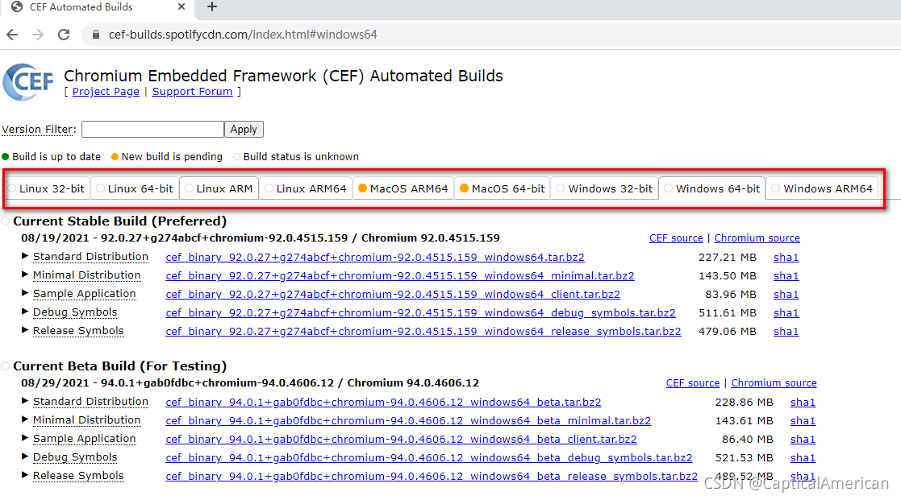
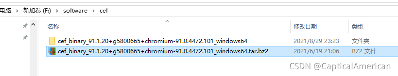
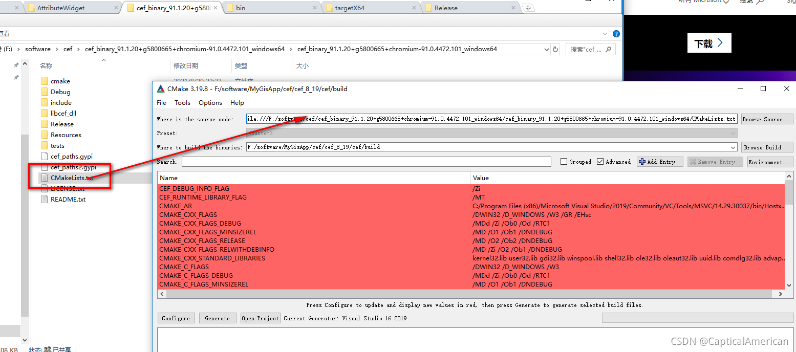
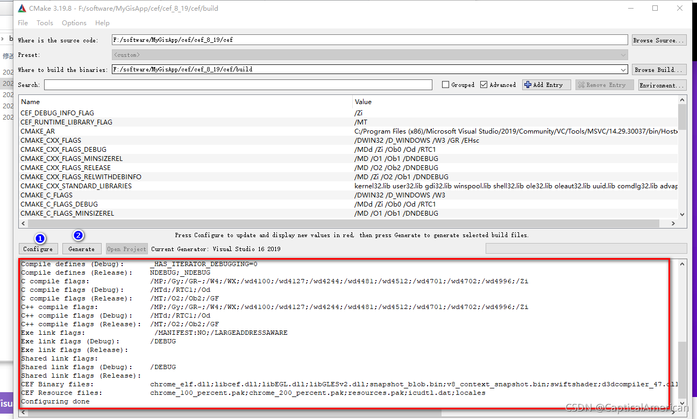
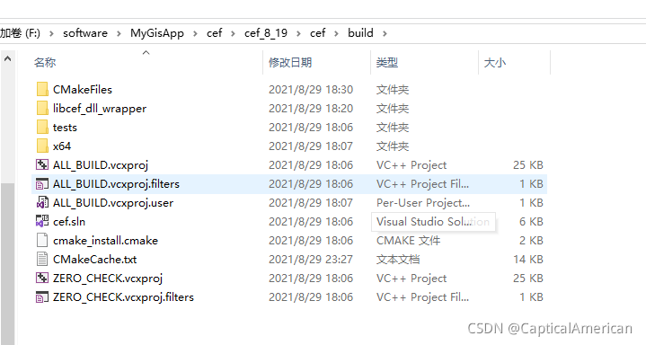
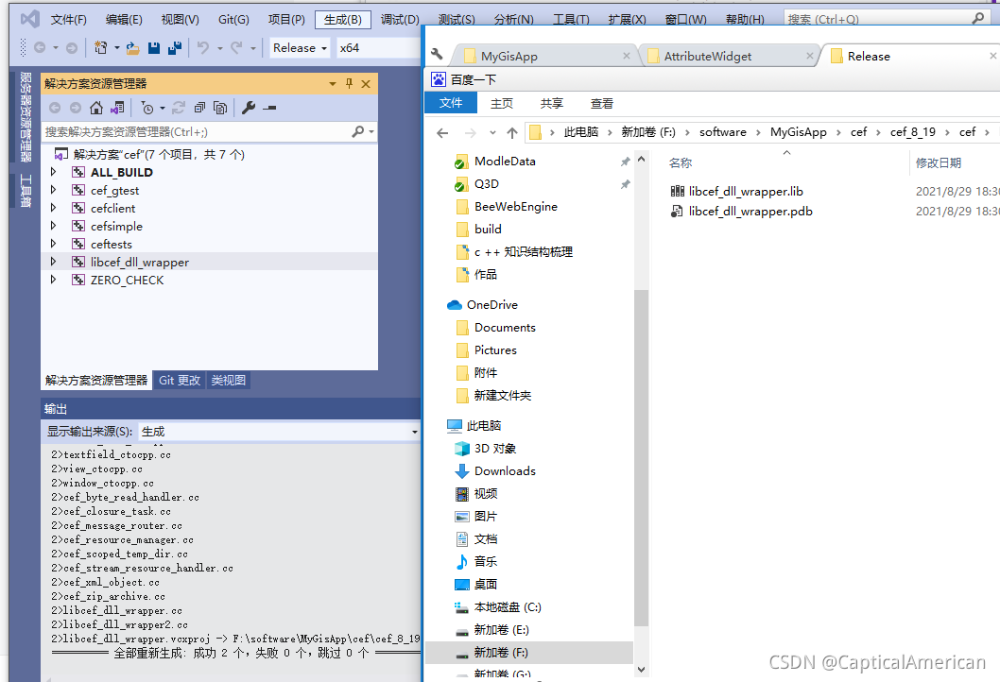
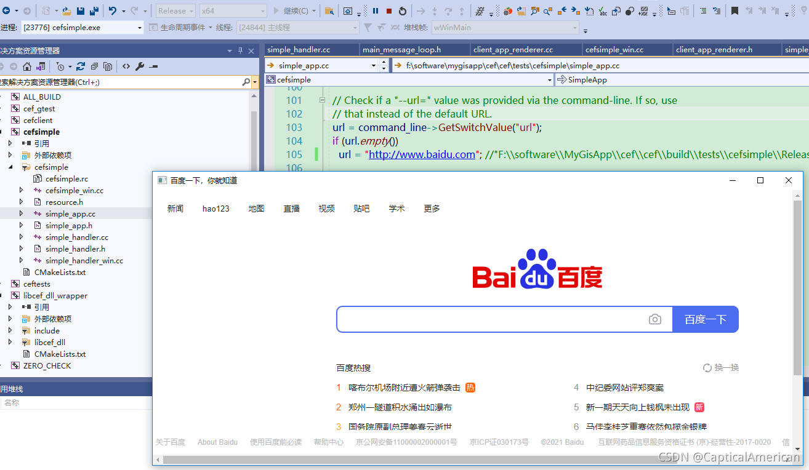
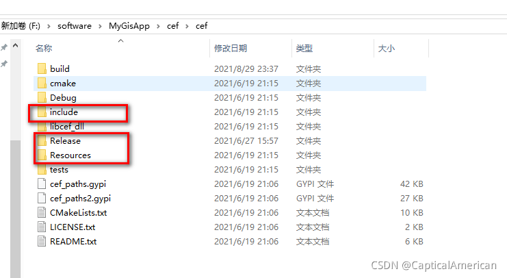
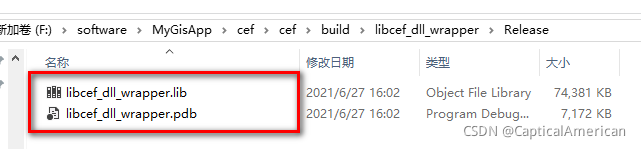

# chrome 内核CEF 编译和qt 封装（上）

软件开发项目经验总结

前言：

针对PC 客户端软件而言，在实际开发中如图表等复杂控件如果纯用c++ 开发难度很大，而且效果也不是很美好，虽然也有一些专门开源图表库可以使用，但项目中软件开发都是C/S 和 B/S 结构，两者各有其优势。B/S结构需要 浏览器作为前端页面交互入口。C/S 结构需要客户端作为交互入口，是否有相关技术能结合两者优势开发，通过尽可能的一套代码能解决两端多数业务问题呢，CEF 或者其他浏览器内核的出现就解决此问题。

一、基础概念

Chromium Embedded Framework (CEF)是个基于Google Chromium项目的开源Web browser控件，支持Windows, Linux, Mac平台。除了提供C/C++接口外，也有其他语言的移植版。过多概念不展开，可百度。

二、CEF 编译

1、准备成果物

直接下载二进制成果物进行相关库的编译，连接： 

https://cef-builds.spotifycdn.com/index.html#windows64

从下图可以找到自己需要版本进行下载：

2、 准备代码编译工具 cmaKe 、 vs 2019

   cmake 下载官网： https://cmake.org/

   vs 下载官网： https://visualstudio.microsoft.com/zh-hans/

3、  开始编译

（1）下载完的zip 包通过cmake 检出代码。

 

 

1和 2  步骤后就产生如下工程

 重点是libcef_dll_wrapper  此库。 编译成功后会产生 libcef_dll_wrapper.lib 和 libcef_dll_wrapper.pdb  两个文件。

 

可以通过cefsimple 例子实现编译的成果物，例如加载百度和自己设计页面，如下：

 自己通过echars 制作的页面

 基本上所需要的的内容如下

  

 三、 qt 封装 cef 库

    但在实际项目开发过程中 cef 初始化内容比较多，开发流程比较复杂不利于项目开发。因此需要对库进行再次封装，统一初始化流程和相关接口。封装流程和原理下文再分享！

相关类的介绍可查看： 也可通过源代码头文件的英文注释了解

https://www.cnblogs.com/bclshuai/p/12722607.html

————————————————

版权声明：本文为CSDN博主「CapticalAmerican」的原创文章，遵循CC 4.0 BY-SA版权协议，转载请附上原文出处链接及本声明。
原文链接：https://blog.csdn.net/qq_22820413/article/details/119987543