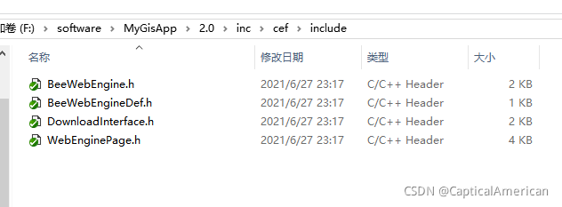
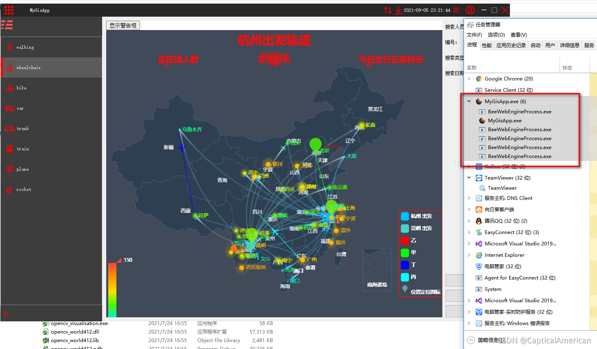

# chrome 内核CEF 编译和qt 封装（下）

软件开发项目经验总结

 上篇讲述了如何编译cef 成果物以及验证方法。 但在实际开发过程中需要对cef 关键库进行再次封装，以便在项目开发过程中更加方便的使用此库。本文结合qt 框架进行此库的封装。

一、 CEF结构介绍

1、 CEF主进程和窗口之间的结构关系

一个浏览器有很多个CefBrowser窗口，这些窗口都是在Browser进程中创建。browser进程用来管理和处理回调函数消息。Renderer进程用来实现网页的渲染，每个renderer进程包含有一个主网页mainframe和多个子网页subframe。

2、Renderer进程的实现结构

renderer程序继承CefApp和CefRenderProcessHandler类，在main函数中初始化。通过CefSettings.browser_subprocess_path配置render可执行程序路径。browser进程就会去启动这个进程去渲染网页。

 3、browser进程的实现结构

browserapp要继承CefApp和CefBrowserProcessHandler类。实现browserapp的定义。同时要新建clienthandler类实现图中的回调函数接口类，用来处理拦截响应请求、管理生命周期、下载、显示加载、右键菜单等。在mian函数中初始化、启动消息循环。调用CefBrowserHost的静态方法创建browser窗口对象，在render进程的Frame中加载渲染内容。

二、cef  进程开发模式

1、进程
CEF3是多进程架构的，CEF3进程主要有一个Browser（浏览器）进程和多个Renderer（渲染）进程。Browser被定义为主进程，负责窗口管理，网络请求，网页管理 、网络交互。browser从服务器器请求到了响应，将html文本发送给Renderer 进程，render进程加载html，进行渲染，展示网页的内容；除此之外，Renderer进程还负责Js Binding和对Dom节点的访问。Browser和Renderer进程可以通过发送异步消息进行双向通信。主应用程序很大，加载时间比较长，或者不能在非浏览器进程里使用，则宿主程序可使用独立的可执行文件去运行这些Renderer进程。这可以通过配置CefSettings.browser_subprocess_path变量做到。

2、 线程
Browser进程中包含如下主要的线程：

TID_UI 线程是浏览器的主线程。如果应用程序在调用调用CefInitialize()时，传递CefSettings.multi_threaded_message_loop=false，这个线程也是应用程序的主线程。
TID_IO 线程主要负责处理IPC消息以及网络通信。
TID_FILE 线程负责与文件系统交互。
每个CEF3应用程序都是相同的结构
提供入口函数，用于初始化CEF、运行子进程执行逻辑或者CEF消息循环。
提供CefApp实现，用于处理进程相关的回调。
提供CefClient实现，用于处理Browser实例相关的回调。
执行CefBrowserHost::CreateBrowser()创建一个Browser实例，使用CefLifeSpanHandler管理Browser对象生命周期。
需要在程序的入口函数执行cef对象创建，初始化，命令行参数解析，CEF属性设置，和CEF消息循环开启等。CEF需要启动一个主进程来管理网页见面。这个主进程就是在man函数中启动，进入消息循环，直到程序结束，才退出main函数。
3.   CEF单实例进程
        demo里的单进程例子 

单进程开发模式：

 多进程开发模式：

三、 qt 封装

1、构建qt  主进程 dll 工程。为了实现把cef 相关接口信息透传到qt 主进程里。

主进程重写cef 提供的类：

ClientHandler、 public CefApp

 

  

子进程重写cef 提供的类

 CefApp、CefRenderProcessHandler、CefV8Handler

 

2、核心原理：通过上层定义cef 提供的相关接口指针，并结合c++ 11 提供的std::function、std::bind 功能实现上层指针和底层指针绑定。通过此技术实现cef 底层接口参数能通过qt 信号槽机制发送到对应的界面，通过功能函数模板 实现对cef  底层相关的接口调用，最终达到预期目的，实现cef 层的qt 封装。

 3.最后相关成果物

需要导出的头文件如下：

 

 在工程属性文件里配置头文件和lib 库路径，然后根据程序的初始化流程创建cef 窗口，并把窗口插入到界面布局中，show 即可。

验证结果如下：

核心类的详解参考：https://www.cnblogs.com/bclshuai/p/12722607.html
————————————————
版权声明：本文为CSDN博主「CapticalAmerican」的原创文章，遵循CC 4.0 BY-SA版权协议，转载请附上原文出处链接及本声明。
原文链接：https://blog.csdn.net/qq_22820413/article/details/120115341