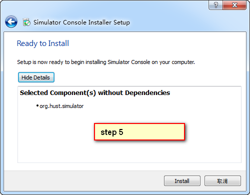

# 使用Qt installer framework制作安装包 #

一、介绍

使用Qt库开发的应用程序，一般有两种发布方式：（1）静态编译发布。这种方式使得程序在编译的时候会将Qt核心库全部编译到一个可执行文件中。其优势是简单单一，所有的依赖库都集中在一起，其缺点也很明显，可执行程序体量较大，光Qt核心库加起来就得十多兆。（2）制作安装包发布。这种方式的原理也简单，就是将可执行程序和其依赖的库文件一起打包压缩，制作成安装包发布。制作安装包的工具挺多，今天要说的是Qt官方的安装包制作框架Qt installer framework.这个框架由Qt官方出品，广泛应用于Qt library, Qt Creator等安装包产品。网上搜了一下，相关教程貌似不多。

二、配置使用

下载并安装好Qt installer framework之后，需要创建目标文件夹。所有需要打包的文件都放到这个文件夹下。我的文件夹内容如下：


然后我们需要安装如下的目录组织结构分别创建文件夹，注意的是，一定要安装这样的顺序组织文件夹哦。最简单的方法是从Qt installer framework安装目录下的examples里面复制一个出来，在此基础上进行修改：


我创建的根文件夹名称为sc.在sc下面又创建了两个子文件夹：config和packages。在config文件夹下创建一个config.xml文件，该文件用于定制安装包的UI和行为，其基本格式如下：

```
<?xml version="1.0"?>
<Installer>
    <Name>Some Application</Name>
    <Version>1.0.0</Version>
    <Title>Some Application Setup</Title>
    <Publisher>Your Company</Publisher>
    <ProductUrl>http://www.your-fantastic-company.com</ProductUrl>
    <InstallerWindowIcon>installericon</InstallerWindowIcon>
    <InstallerApplicationIcon>installericon</InstallerApplicationIcon>
    <Logo>logo.png</Logo>
    <Watermark>watermark.png</Watermark>
    <RunProgram></RunProgram>
    <RunProgramArguments></RunProgramArguments>
    <RunProgramDescription></RunProgramDescription>
    <StartMenuDir>Some Application Entry Dir</StartMenuDir>
    <UninstallerName>SDKMaintenanceTool</UninstallerName>
    <AllowNonAsciiCharacters>true</AllowNonAsciiCharacters>
    <Background>background.png</Background>
 
    <TargetDir>@homeDir@/testinstall</TargetDir>
    <AdminTargetDir>@rootDir@/testinstall</AdminTargetDir>
    <RemoteRepositories>
        <Repository>
            <Url>http://www.your-repo-location/packages/</Url>
        </Repository>
    </RemoteRepositories>
</Installer>
```

其中，name和version子元素是必需的，其他子元素则是可选的，并且顺序可以任意。关于这些配置项的含义，在官方网站的链接上可以查看。

在上面的图中我们可以看到，我们创建名为org.hust.simulator的文件夹。事实上，Qt installer framework引入了组件的概念。即每一个独立模块可以单独放在一个组件component中，对于大型程序这样清晰的结构有利于工程组织，降低复杂度。例子中比较简单，只使用了一个组件，根据需要可以创建多个组件：

```
packages
    - com.vendor.root
        - data
        - meta
    - com.vendor.root.component1
        - data
        - meta
    - com.vendor.root.component1.subcomponent1
        - data
        - meta
    - com.vendor.root.component2
        - data
        - meta
```

可以注意到，在packages文件夹下每个组件都需要创建两个子文件夹meta和data。meta目录下用于存放一些配置文件，用于指定安装和部署过程。在meta文件夹中至少需要一个package.xml及所有在该文件中引用到的资源文件，如脚本文件、界面资源、翻译文件等。package.xml文件描述了一个组件的基本信息，其格式如下：

```
<?xml version="1.0"?>
<Package>
    <DisplayName>QtGui</DisplayName>
    <Description>Qt gui libraries</Description>
    <Description xml:lang="de_de">Qt GUI Bibliotheken</Description>
    <Version>1.2.3</Version>
    <ReleaseDate>2009-04-23</ReleaseDate>
    <Name>com.vendor.root.component2</Name>
    <Dependencies>com.vendor.root.component1</Dependencies>
    <Virtual>false</Virtual>
    <Licenses>
        <License name="License Agreement" file="license.txt" />
    </Licenses>
    <Script>installscript.qs</Script>
    <UserInterfaces>
        <UserInterface>specialpage.ui</UserInterface>
        <UserInterface>errorpage.ui</UserInterface>
    </UserInterfaces>
    <Translations>
        <Translation>sv_se.qm</Translation>
        <Translation>de_de.qm</Translation>
    </Translations>
    <DownloadableArchives>component2.7z, component2a.7z</DownloadableArchives>
    <AutoDependOn>com.vendor.root.component3</AutoDependOn>
    <SortingPriority>123</SortingPriority>
    <UpdateText>This changed compared to the last release</UpdateText>
    <Default>false</Default>
    <ForcedInstallation>false</ForcedInstallation>
    <Essential>false</Essential>
    <Replaces>com.vendor.root.component2old</Replaces>
</Package>
```

其中License节中指定了协议条款，file属性指定了协议条款所在的文件。UserInterfaces和Translations节分别指定了界面资源文件和翻译文件。Script节指定了脚本文件，在脚本文件中可以对安装过程进行更为详细的定制。样例中其他元素名称及值都比较容易懂，对着修改并不困难。全部选项可以上官网查看。

data文件夹中则用于存放我们实际需要打包的程序文件（*.dll, *.exe等），Qt installer framework在制作过程中用archivegen会将这些文件压缩成7zip格式。安装过程中自动从压缩包中提取出数据文件。最后我的文件组织结构如下：


为了方便，我将这个sc文件夹直接拖到了Qt installer framework的安装目录下，这样就可以在命令行下直接使用binarycreator.exe这个工具了。准备工作完成，开始生成安装包：


    binarycreator.exe -c sc\config\config.xml -p sc\packages my_installer.exe -v

命令运行完成，将在binarycreator.exe所在目录下生成my_installer.exe文件。运行起来看看：





三、小结

从上面看整个配置过程还算是挺简单的，官方手册也很齐全。不得不感叹文档健全就是好啊。以前都是使用其他的工具制作安装包，这次尝试了一下Qt installer framework制作安装包还算满意。

参考

http://doc.qt.io/qtinstallerframework/ifw-tutorial.html

http://www.cnblogs.com/dyllove98/archive/2013/06/17/3141316.html

http://www.qt.io/download-open-source/#


http://www.cnblogs.com/csuftzzk/p/qt-installer-framework.html