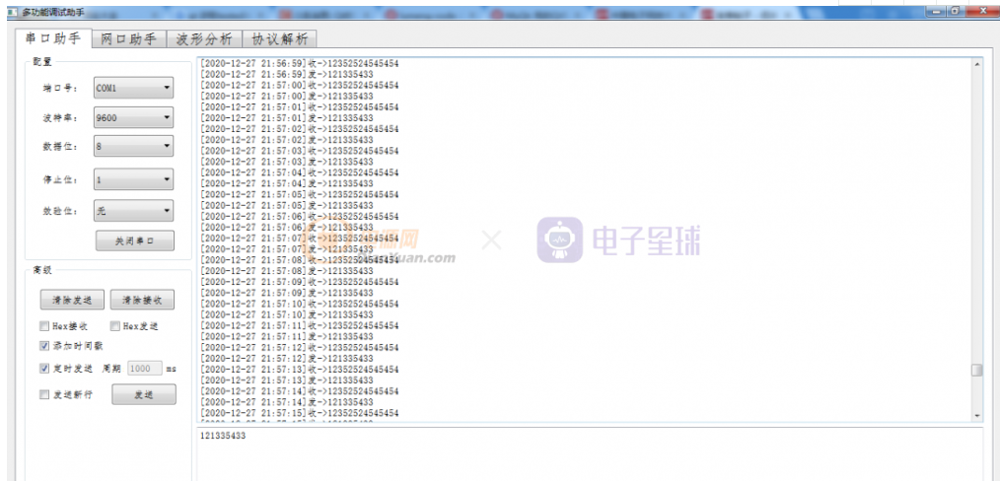
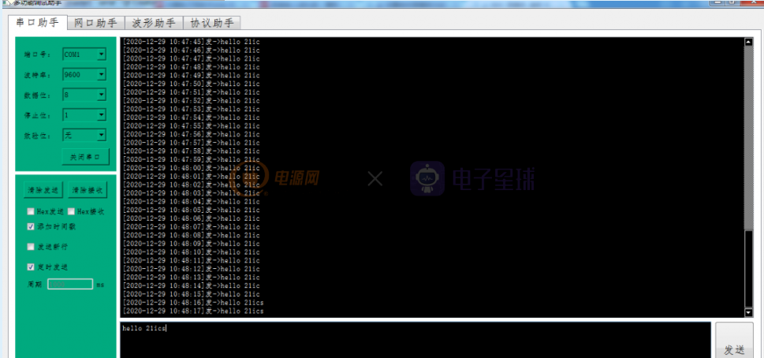

# 开源之Qt 串口助手(源码)

​    串口调试助手是一款用于嵌入式开发串口调试的必备工具，目前网上存在很多个版本，功能都差不多，但稳定性有好有坏，如果只用于一般的串口调试，这些工具够用了，如果想开发一款适于自己的串口调试助手，本文也许可以帮你。本文中的调试助手用QT开发，QT的开发环境不在这里详述了，不会安装的可以在网上找找类似的博文吧，以下仅供参考。

实现的功能：

1.自动获取计算机的端口号；

2.串口参数可更改：包括 波特率、数据位、停止位、校验和等............

3.串口数据的发送和接收

4.支持十六进制数据的发送和接收

5.支持时间戳功能，方便文件的存储查看

6.发送从窗口和接收窗口的清理

7.定时发送功能



简单设置一下背景色，好看多了！



**代码部分：**

**1.当我们的计算机的端口号发生改变时，串口助手要具备实时扫面本机的端口号的功能，具有实时获取有效的串口信息，并将其刷新到下拉框中供我们选择。有些自己编写的串口助手是没有这个功能的，这里我给大家补充上去。**

```cpp
//使用foreach获取有效的串口信息
     foreach(const QSerialPortInfo &info, QSerialPortInfo::availablePorts())
     {
         //这里相当于自动识别串口号之后添加到了cmb，如果要手动选择可以用下面列表的方式添加进去
         Serial.setPort(info);
         if(Serial.open(QIODevice::ReadWrite))
         {
             //将串口号添加到cmb
             ui->comboBox_Port->addItem(info.portName());
             //关闭串口等待人为(打开串口按钮)打开
             Serial.close();
         }
     }
```

Copy

2.填充下拉框的波特率、数据位、停止位、效验位….，初始化下拉框默认参数，这个参数设置大部分的串口助手都会具备，因此不足为奇。该有的功能个咱还是得有的。

```cpp
// 填充波特率
    QStringList Baud;
    Baud<<"1200"<<"2400"<<"4800"<<"9600"<<"38400"<<"115200";
    ui->comboBox_Baud->addItems(Baud);
    // 填充数据位
    QStringList DataBit;
    DataBit<<"5"<<"6"<<"7"<<"8";
    ui->comboBox_DataBit->addItems(DataBit);
    // 填充停止位
    QStringList StopBit;
    StopBit<<"1"<<"1.5"<<"2";
    ui->comboBox_StopBit->addItems(StopBit);
    // 填充效验位
    QStringList CheckBit;
    CheckBit<<"奇效验"<<"偶效验"<<"无";
    ui->comboBox_CheckBit->addItems(CheckBit);

    //初始化默认参数
    ui->comboBox_Baud->setCurrentIndex(3); //默认9600
    ui->comboBox_DataBit->setCurrentIndex(3); //默认8bit Data
    ui->comboBox_StopBit->setCurrentIndex(0); //默认1bit Stop
    ui->comboBox_CheckBit->setCurrentIndex(2); //默认 无效验
```

Copy

3.串口打开和关闭按钮操作，这个就是打开串口按钮和关闭按钮的逻辑操作，成功打开串口后，相应的参数将会被设置。串口即可以用于数据的发送和接收了，这里也处理，打开失败时的逻辑操作，可谓是“疏而不漏也！”。

```cpp
//串口打开和关闭按钮
void MainWindow::on_pushButton_Open_clicked()
{
    //设置串口号;也就是说打开的是当前显示的串口
    if(ui->comboBox_Port->currentText().isEmpty())
    {
        QMessageBox::information(this,"提示","没有可用的串口");
        return;
    }
    Serial.setPortName(ui->comboBox_Port->currentText());
    if(ui->pushButton_Open->text() == "打开串口")
    {
           if(Serial.open(QIODevice::ReadWrite))//读写方式打开,成功后设置串口
           {
               //设置波特率
               Serial.setBaudRate(ui->comboBox_Baud->currentText().toInt());

               //设置数据位
               switch(ui->comboBox_DataBit->currentText().toInt())
               {
                     case 5:
                             Serial.setDataBits(QSerialPort::Data5);
                     break;
                     case 6:
                             Serial.setDataBits(QSerialPort::Data6);
                     break;
                     case 7:
                              Serial.setDataBits(QSerialPort::Data7);
                     break;
                     case 8:
                              Serial.setDataBits(QSerialPort::Data8);
                     break;
                     default:
                              QMessageBox::information(this,"提示","数据位配置出错");
                              return;
                     break;
               }

               //设置校验位
               if (ui->comboBox_CheckBit->currentText() == "奇效验")
               {
                   Serial.setParity(QSerialPort::OddParity);
               }
               else if (ui->comboBox_CheckBit->currentText() == "偶效验")
               {
                   Serial.setParity(QSerialPort::EvenParity);
               }
               else if (ui->comboBox_CheckBit->currentText() == "无")
               {
                   Serial.setParity(QSerialPort::NoParity);
               }

               //设置停止位
               if (ui->comboBox_StopBit->currentText().toFloat() == 1)
               {
                   Serial.setStopBits(QSerialPort::OneStop);
               }
               else if(ui->comboBox_StopBit->currentText().toFloat() == 1.5)
               {
                   Serial.setStopBits(QSerialPort::OneAndHalfStop);
               }
               else if(ui->comboBox_StopBit->currentText().toFloat() == 2)
               {
                   Serial.setStopBits(QSerialPort::TwoStop);
               }

               //设置流控制
               Serial.setFlowControl(QSerialPort::NoFlowControl);
               ui->pushButton_Open->setText("关闭串口");


               //建立串口接收的槽函数
               connect(&Serial,&QSerialPort::readyRead ,this,&MainWindow::ReadRecData);

              // timer0->start(100);

            }
           else//串口打开失败
           {
               QMessageBox::about(NULL, "提示", "打开出错，串口被占用！");
               return ;
           }
    }
    else if(ui->pushButton_Open->text() == "关闭串口")
    {
        Serial.close();//关串口
        //timer0->stop();
        ui->pushButton_Open->setText("打开串口");
    }
}
```

Copy

4. 串口接收数据函数（支持时间戳、HEX接收） 这个是很关键的地方了，要保证数据接收的完整性和实时性，可采用两种接收数据的模式：定时器触发和槽触发，定时器触发我这里采用的是100ms的中断接收，大家还可以调的更小一点。

```c
void MainWindow::ReadRecData()
{
    QByteArray readData = Serial.readAll();//读取串口数据
    QByteArray NewData;
    QString current_date;

   if(readData != NULL)//将读到的数据显示到数据接收区
   {
       if(HexRecvFlag)  //判断是否使用HEX
       {
           //判断是否使用时间戳
           if(EnableTimeFlag == 1)
           {
               current_date_time = QDateTime::currentDateTime();
               current_date += "[";
               current_date += current_date_time.toString("yyyy-MM-dd hh:mm:ss");
               current_date += "]收->";
               ui->textEdit_Recv->append(current_date.toUtf8() + readData.toHex());
           }
           else
           {
              ui->textEdit_Recv->append(readData.toHex());
           }

       }
       else
       {
           //判断是否使用时间戳
           if(EnableTimeFlag == 1)
           {
               current_date_time = QDateTime::currentDateTime();
               current_date += "[";
               current_date += current_date_time.toString("yyyy-MM-dd hh:mm:ss");
               current_date += "]收->";
               ui->textEdit_Recv->append(current_date.toUtf8() + readData);
           }
           else
           {
              ui->textEdit_Recv->append(readData);
           }
       }

   }
}
```

Copy

5. 串口发送数据函数（支持时间戳、HEX接收） 这个是很关键的地方了，串口发送数据的方式就比较简单了，直接将数据送入缓冲区

```cpp
//发送数据
void MainWindow::on_pushButton_Send_clicked()
{
    QString DataStr;
    QString NewData;
    QString current_date;

    DataStr = ui->textEdit_Send->toPlainText();
    if(ui->pushButton_Open->text() == "打开串口")
    {
       QMessageBox::information(this,"提示","未打开串口");
       return;
    }

    if(EnableTimeFlag == 1)
    {
        current_date_time = QDateTime::currentDateTime();
        current_date += "[";
        current_date += current_date_time.toString("yyyy-MM-dd hh:mm:ss");
        current_date += "]发->";
        NewData = current_date + DataStr;
    }
    else
    {
      NewData = DataStr;
    }

    if(HexSendFlag)
    {
       Serial.write(DataStr.toUtf8().toHex());//写入缓冲区
    }
    else
    {

      ui->textEdit_Recv->append(NewData.toUtf8());
    }
}
```

Copy

6.清除接收和发送窗口数据函数，为了方便调试和观察，这里添加了清除接收和发送窗口数据函数的操作。

```c
//清除接收窗口数据
void MainWindow::on_pushButton_ClearRecv_clicked()
{
   ui->textEdit_Recv->clear();
}

//清除发送窗口数据
void MainWindow::on_pushButton_2_clicked()
{
   ui->textEdit_Send->clear();
}
```

Copy

7.使能时间戳，时间戳的主要目的在于通过一定的技术手段，对数据产生的时间进行认证，从而验证这段数据在产生后是否经过篡改。所以时间戳服务的提供者必须证明服务中使用的时间源是可信的，所提供的时间戳服务是安全的。

```c
void MainWindow::on_checkBox_EnableTime_clicked(bool checked)
{
     if(checked == true)
     {
         EnableTimeFlag = 1;
     }
     else
     {
         EnableTimeFlag = 0;
     }
}
```

Copy

8. 使能定时发送，定时发送很香了，必须得有啊！

```cpp
void MainWindow::on_checkBox_clicked(bool checked)
{
    if(checked == true)
    {
        if(ui->pushButton_Open->text() == "打开串口")
        {
           QMessageBox::information(this,"提示","未打开串口");
           ui->checkBox->setChecked(false);
           return;
        }
        quint32 stime= ui->lineEdit_STime->text().toInt();
        timer_id1 = startTimer(stime);
        ui->lineEdit_STime->setEnabled(false);
    }
    else
    {
       killTimer(timer_id1);
       ui->lineEdit_STime->setEnabled(true);
    }
}
```

Copy

9. 使能HEX 发送和接收按钮，HEX那是标配，我只希望不要出bug，慢慢完善吧！

```cpp
void MainWindow::on_checkBox_HexRecv_clicked(bool checked)
{
    if(checked)
    {
        HexRecvFlag = 1;
    }

    else
        HexRecvFlag = 0;
}

void MainWindow::on_checkBox_HexSend_clicked(bool checked)
{
    if(checked)
        HexSendFlag = 1;
    else
        HexSendFlag = 0;
}
```

Copy

10. 定时器中断函数 触发接收串口数据的核心，没它啥也干不了。

```cpp
void MainWindow:: timerEvent(QTimerEvent *ev)
{
    if(ev->timerId() == timer_id1)
    {
       on_pushButton_Send_clicked();
    }
}
```

Copy


声明：本内容为作者独立观点，不代表电子星球立场。未经允许不得转载。授权事宜与稿件投诉，请联系：editor@netbroad.com